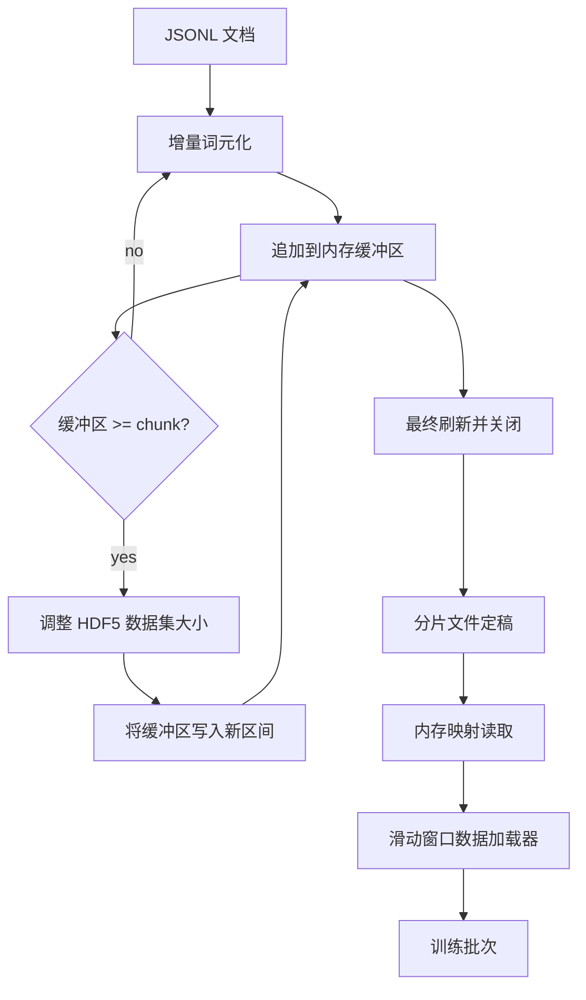

# HDF5 词元化语料库

> 下载得到的语料库必须落在一种训练器能够以线速流式读取的布局中。磁盘上的 JSONL 扛不住 16 个数据加载器（dataloader）工作进程；带有可调整大小、分块整数数据集的 HDF5 可以。本课将把流式词元化（tokenization）构建到一个可调整大小的 HDF5 数据集中，把写入按多个文件进行分片（shard），在训练时进行内存映射读取（memory-mapped read），并实现一个滑动窗口数据加载器（sliding-window dataloader），产出遵循正确打包规则（packing rules）的固定长度序列。

**类型：** 构建
**语言：** Python
**先修要求：** 第 19 阶段第 30-37 课
**耗时：** ~90 分钟

## 学习目标

- 以确定性的分块方式，将文档流式写入一个可调整大小的 HDF5 整数数据集。
- 将写入分散到多个 HDF5 文件中，以便把故障影响限制住并支持并行。
- 通过 HDF5 由页缓存支撑的分块布局把词元读回，使数据加载器只在批次时刻才拷贝到批缓冲区。
- 实现一个滑动窗口数据加载器，按显式打包规则发出固定长度的训练序列。

## 问题

一次现代语言模型训练会在数十个工作进程上，以每秒数十万样本的速度读取词元。磁盘上的 JSONL 在第一次冷缓存缺页时就不行了：JSON 解析器很慢，文档边界不可直接寻址，而想跳到“样本 4,217,884”必须扫描整个文件。即使是压缩效果很好的 Parquet 也不合适，因为训练器需要的不是列，而是一个支持 O(1) 随机访问的扁平词元流。

HDF5 合适，是因为它提供了分块、可调整大小、仅存整数的数据集，其分块在读取时对页缓存很友好。训练器请求 `tokens[3,200,000 : 3,200,8192]` 这样的切片时，HDF5 会把请求的超切片（hyperslab）从页缓存复制到一个新分配的 NumPy 数组中。每个工作进程的代价只是一个打开的文件句柄，以及一个按 chunk 大小计算的页缓存占用；与解码 JSONL 的成本相比，这几乎可以忽略不计。

真正的构建难点在于让写入端保持规范。可调整大小数据集很容易被误用：如果一次写一个文档，HDF5 文件会碎片化到不可用；如果一次 resize 写入全部文档，进程一旦死亡就会丢掉整个分片。正确的纪律是“先缓冲，再扩展”，并让缓冲区大小与 chunk 大小一致，同时采用跨文件的分片写入，使一次崩溃最多只丢失一个分片。

## 概念



### 正确实现可调整大小的 HDF5

词元数据集以 `maxshape=(None,)` 和固定的 `chunks=(chunk_size,)` 创建。写入过程会把词元先缓冲到一个长度为 `chunk_size` 的 NumPy 数组中。当缓冲区写满时，数据集会按精确的 `chunk_size` 扩容，并把缓冲区写入新范围。分片结束时，残余缓冲区会写入最后一个部分填充的范围。除最后一次写入外，所有写入都是连续且按 chunk 对齐的；最后这段由读取端根据分片 HDF5 属性里记录的 `token_count` 截断。

### 分片写入

单个 HDF5 文件就是单点故障。流水线并行写出多个分片：第 19 阶段第 42 课的每个输入分片，都会生成一个 HDF5 输出分片。一个 `shards.json` 索引会为每个分片记录文件路径、词元数量、文档数量，以及覆盖这些词元的 sha256。训练器读取 `shards.json` 来计算全局偏移量，并校验整个语料库。

### 内存映射读取

训练时，每个工作进程都会以 `swmr=True` 模式打开自己负责的 HDF5 文件，并请求 `tokens[start:stop]`。一旦 chunk 变热，HDF5 的分块布局就会把它变成一次由页缓存支撑的读取。工作进程不会把整个文件具体化到内存中：切片会先拷贝到数据加载器的批缓冲区，随后数据加载器在批次时刻再把它拷贝到固定页内存的训练张量中。热路径上，每次跨 chunk 只需要一次系统调用，其余都是 RAM 访问。

### 滑动窗口数据加载器

数据加载器是唯一知道训练序列长度的阶段。它会在全局词元流中随机挑选一个起始索引，读取 `window_size + 1` 个词元，并返回 `(input, target) = (tokens[:-1], tokens[1:])`。这里不会强制文档边界：一个窗口可以跨越两个文档，两者之间用显式的 `boundary_token_id` 分隔，让模型学会利用这个分隔符。这是标准的打包规则；同时也是初学者最容易忘记的规则，忘了之后，语料库就会变成 8% 的训练边界词元和 92% 的自然文本。

## 动手实现

`code/main.py` 实现了：

- `Tokenizer` - 一个字节级、确定性的分词器，足以支撑这个演示。接口是 `encode(text) -> list[int]` 和 `vocab_size`。
- `HDF5ShardWriter` - 打开一个可调整大小的整数数据集，把词元缓冲到 chunk 大小，按固定步长 resize 并写入，关闭时把 `token_count` 和 `sha256` 记录为 HDF5 属性。
- `ShardedTokenizationPipeline` - 遍历输入文档，把它们路由给对应的写入器，并输出一个 `shards.json` 索引。
- `MmapTokenStore` - 打开分片文件以供内存映射读取，计算全局偏移，并暴露统一的 `get_slice(start, stop)` API。
- `SlidingWindowDataloader` - 从全局词元流中随机抽取窗口，并产出 `(input_ids, target_ids)` NumPy 数组。

文件底部的演示会构建一个很小的内存语料库，把它词元化到两个分片中，经由内存映射重新打开，然后让数据加载器跑 10 个批次，并打印每个批次的形状与校验和。

运行：

```bash
python3 code/main.py
```

脚本会以零状态码退出，并打印批次校验和。

## 生产模式

有四种模式可以把本课扩展到真实训练中。

**Chunk 大小等于典型读取大小。** 训练器每个样本读取 `window_size + 1` 个词元。把 HDF5 chunk 设为 `window_size` 的倍数，读取就能与页缓存对齐。如果 chunk 不匹配，吞吐量会减半，因为每个样本都会触碰两个 chunk。

**词元数量存放在属性里，而不是数据集里。** 由于 chunk 大小未必整除文档边界，数据集末尾那段切片可能只部分填满。把真实的 `token_count` 作为 HDF5 属性存到数据集上，并让读取端按这个值截断。否则，读取端会越界读进补零词元，模型就会学着去预测 0。

**按分片计算 sha256，并支持并行校验。** 每个分片都对其词元字节拥有独立的 sha256。训练开始前，训练器可以并行校验所有分片。sha256 一旦错误，就会在训练开始前立刻失败，而不是在 16 小时后的第三个 epoch 才暴露。

**读写两端都用 `swmr=True`，并让写入端使用 `libver="latest"`。** Single-Writer-Multiple-Reader 模式要求写入端用 `libver="latest"` 打开文件，预先创建所有数据集，然后设置 `file.swmr_mode = True`。之后，写入端必须在每次 resize 后调用 `dataset.flush()`，这样以 `swmr=True` 打开的读取工作进程才能看到一致的数据。跳过 `libver="latest"`，或在结构性变更后再启用 SWMR，都是“file is locked”故障的常见来源。

## 使用它

生产实践：

- **每个源分片对应一个 HDF5。** 下载器（第 42 课）每个 URL 输出一个分片；词元化（本课）则为每个源分片输出一个 HDF5。1:1 映射让断点续跑和局部失败恢复都变得非常简单。
- **边界词元 ID。** 边界词元是分词器词表的一部分，也是数据加载器唯一会注入的词元。如果模型应忽略这个词元，训练损失会屏蔽它；否则模型会学会把它当作序列分隔符。
- **把 `shards.json` 作为唯一事实来源。** 新增一个分片意味着：写出 HDF5、计算它的 sha256、追加一条索引项。训练器启动时只读取一次该文件，之后不再碰目录列表。

## 交付它

在真实项目中，`outputs/skill-hdf5-tokenized-corpus.md` 会说明：哪一个分词器为流水线供词元、哪种 chunk 大小与训练器窗口匹配、版本控制中的 `shards.json` 位于何处，以及数据加载器工作进程如何按文件分片。本课交付的是引擎。

## 练习

1. 为 HDF5 写入器增加一个 `--compression gzip` 标志，并测量它在演示语料库上的吞吐代价。为你选择的默认值做出论证。
2. 给滑动窗口数据加载器增加一个确定性随机种子，并验证两次使用相同种子的运行会生成完全一致的批次。
3. 增加一个 `--validate` 模式，读取每个分片，重新计算其词元上的 sha256，并与 `shards.json` 比较。CI 应在训练开始前运行它。
4. 比较 chunk 大小等于窗口大小、窗口大小的一半、以及窗口大小两倍时的数据加载器吞吐量。报告页缓存效应。
5. 增加一个 `--max-document-tokens` 标志，在写入时截断超长文档。论证它相对于在读取时再决定的取舍。

## 关键术语

| 术语 | 人们常说 | 实际含义 |
|------|----------|----------|
| 可调整大小数据集 | “只能追加” | 一个带有 `maxshape=(None,)` 的 HDF5 数据集，通过按 chunk 大小步进的 `resize` 调用增长 |
| 分块布局 | “HDF5 怎么存它” | 固定大小的磁盘页，内核可以对其做内存映射，数据加载器也能连续读取 |
| `swmr` 模式 | “边写边读” | Single-Writer-Multiple-Reader 模式，让数据加载器工作进程能够安全共享文件 |
| 分片索引 | “shards.json” | 一个持久索引，记录所有词元分片及其偏移与内容哈希 |
| 滑动窗口 | “训练样本” | 全局词元流中的固定长度切片，训练器会把它与右移一位的目标配对 |

## 延伸阅读

- [HDF5 chunking documentation](https://docs.hdfgroup.org/hdf5/v1_14/) - 本课使用的分块、可调整大小数据集布局
- [h5py user guide](https://docs.h5py.org/en/stable/) - HDF5 的 Python 绑定
- [NumPy memory mapping](https://numpy.org/doc/stable/reference/generated/numpy.memmap.html) - HDF5 通过 h5py 暴露出的读取侧原语
- 第 19 阶段 · 42 - 本课对其输出进行词元化的下载器
- 第 19 阶段 · 44 - 消费此数据加载器的余弦调度
- 第 19 阶段 · 45 - 包裹训练步骤的 AMP 循环
