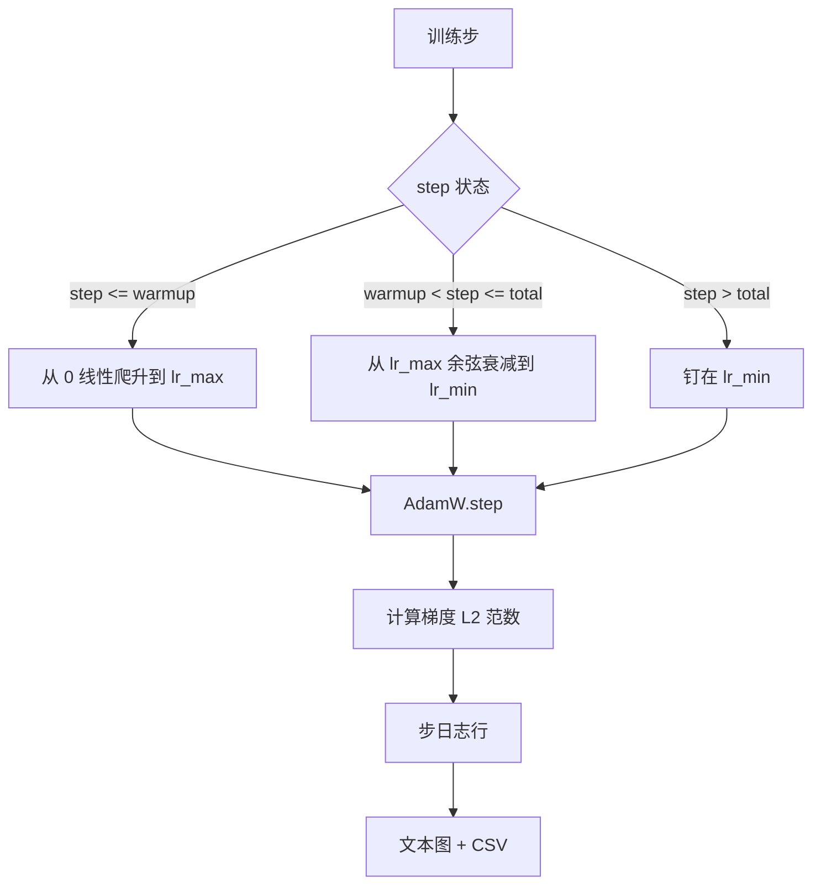

# 带线性预热的余弦学习率

> 学习率（learning rate）调度器是仅次于损失函数（loss function）的第二重要决策。对于语言模型训练，采用线性预热（linear warmup）加余弦衰减（cosine decay）的 AdamW 是现代默认选择，因为它让模型在脆弱的最初几千次更新中看到较小的有效步长，随后爬升到设定的峰值，再平滑衰减回接近零的位置。本课将构建这个调度器，在训练步数上绘制曲线，把梯度 L2 范数（gradient L2 norm）与调度并排记录，并证明该调度严格遵守预热、峰值和衰减边界。

**类型：** 构建
**语言：** Python
**先修要求：** 第 19 阶段第 30-37 课
**耗时：** ~90 分钟

## 学习目标

- 实现一个连接到带线性预热余弦学习率调度的 AdamW 优化器。
- 在任意步上精确计算调度值，避免多次运行之间出现浮点漂移。
- 将梯度 L2 范数与学习率并排记录，使训练健康状况可观测。
- 将调度渲染成肉眼可读的文本图，以及任何工具都可消费的 CSV。

## 问题

训练开始的一千次更新最为嘈杂。此时模型权重仍接近初始化状态，优化器对二阶矩的运行估计尚未稳定，梯度范数又大又噪。如果学习率在这时已经来到峰值，模型要么直接发散，要么陷入一个再也走不出来的损失平台。两个众所周知的修复手段分别是梯度裁剪——这是第 19 阶段第 45 课的主题——以及一个从小值起步再逐渐升高的学习率调度。

带预热的余弦调度分为三个区域。从第 0 步到 `warmup_steps`，学习率从零线性增长到配置的峰值 `lr_max`。从 `warmup_steps` 到 `total_steps`，学习率沿余弦曲线的上半段运行，从 `lr_max` 衰减到 `lr_min`。超过 `total_steps` 之后，学习率会被钉在 `lr_min`，这样即使训练器配置错误、步数跑过头，也不会悄悄脱离调度范围。

构建难点在于，这类调度非常容易出现边界差一（off by one）错误。这种错误会在训练进行六小时后才表现为：模型刚开始过拟合的那个时刻，学习率高了或低了 1%。除非对边界做穷尽测试，否则你根本看不见它。

## 概念



### 预热公式

当 `step` 位于 `[0, warmup_steps]` 且 `warmup_steps > 0` 时，学习率为 `lr_max * step / warmup_steps`。退化情形 `warmup_steps = 0` 被视为“无预热”：调度在第 0 步就直接从 `lr_max` 开始，并立即进入余弦衰减。有些测试框架会传入 `warmup_steps = 0`，以检查调度在这种情况下仍能生成可用曲线。

### 余弦公式

当 `step` 位于 `(warmup_steps, total_steps]` 时，学习率为 `lr_min + 0.5 * (lr_max - lr_min) * (1 + cos(pi * progress))`，其中 `progress = (step - warmup_steps) / max(1, total_steps - warmup_steps)`。在 `step = warmup_steps` 时，余弦值为 `cos(0) = 1`，从而得到 `lr_max`，与预热终点完全一致。在 `step = total_steps` 时，余弦值为 `cos(pi) = -1`，从而得到 `lr_min`，与衰减终点完全一致。

两端点的连续性并非偶然。这正是为什么调度要实现为一个关于 `step` 的单一函数，而不是把三个不同函数硬拼在一起。你第一次修改 `lr_max` 时，拼接式调度就会丢掉其中一个边界。

### 总步数之后的地板值

对于 `step > total_steps`，学习率会保持在 `lr_min`。这个契约是明确的：调度不会报错，也不会外推；它只会把值钉在底部，并让训练器记录一条警告。需要延长训练的训练器，应修改调度的 `total_steps`，而不是去改循环逻辑。

### 与学习率一同记录梯度范数

调度只是训练健康状况的一半，另一半是梯度范数。训练循环会在每一步同时记录两者。发散的训练在损失飙升之前，梯度范数就会先尖峰；调得合适的预热会让范数随学习率近似线性上升；过于激进的峰值则表现为预热结束后范数依旧居高不下。落盘的数据集是 `step, lr, grad_l2_norm, loss`。CSV 是唯一持久记录。

## 动手实现

`code/main.py` 实现了：

- `CosineWithWarmup` - 一个无状态函数 `lr(step) -> float`，覆盖整个已配置调度。
- `TrainState` - 把模型、`AdamW` 优化器和调度封装成单个步进函数。
- `TrainState.step` - 执行一次前向、一次反向，记录梯度 L2 范数，并把 `lr(step)` 应用到优化器。
- `plot_schedule_ascii` - 将调度渲染成肉眼可读的文本图。
- `write_schedule_csv` - 为每一步输出一行学习率记录。

文件底部的演示会构建一个很小的 `nn.Linear` 模型，用固定输入批次训练 20 步，并打印每一步的学习率、梯度范数和损失。调度还会被渲染成文本图，以进行视觉上的合理性检查。

运行：

```bash
python3 code/main.py
```

脚本会以零状态码退出，并打印逐步训练日志以及调度图。

## 生产模式

有四种模式可以把这个调度提升为生产工件。

**调度放在配置里，而不是代码里。** 训练器从提交到 git 的 YAML 或 JSON 配置中读取 `warmup_steps`、`total_steps`、`lr_max`、`lr_min`。调度之所以可复现，是因为配置可按内容寻址；调度之所以可审计，是因为配置就是 PR diff 的一部分。

**步计数器单调递增，并与 epoch 解耦。** 当数据集被分片或数据加载器重启时，一些框架会把步数和 epoch 混淆。调度读取的是训练器检查点中的 `global_step`，而不是本地计数器。恢复运行之所以能接上正确的调度位置，是因为步计数器才是持久坐标轴。

**在运行目录里保存调度图。** 每次训练运行都会把 `outputs/lr_schedule.png`（或者本课中的文本图）写入自己的运行目录。评审者只需快速浏览目录，就能在不重跑任何内容的情况下检查调度是否合理。这能在 PR 阶段就抓住“调度配置错误”这一类 bug。

**日志行模式固定。** 顺序固定为 `step, lr, grad_l2_norm, loss`。下游笔记本或仪表盘会读取这个模式；如果不升级版本就改列名，会使所有现有仪表盘一夜之间全部失效。

## 使用它

生产实践：

- **先扫峰值，再扫其他任何东西。** `lr_max` 是最敏感的旋钮。先在小模型上扫描它；最佳 `lr_max` 与模型规模的关系通常很弱，所以小模型扫描能提供很强的先验。
- **预热应是总步数的比例，而不是绝对数量。** 一个 2 亿步的训练，如果只预热 2,000 步，几乎立刻就到峰值；而一个 20,000 步的训练，用同样的数量则会预热 10%。把预热配置成比例（典型值：1%-3%），这样调度才能随训练时长一起缩放。
- **`lr_min` 非零是有意为之。** 一个等于 `lr_max` 的 10% 的底值，能让优化器在长尾阶段继续学习。`lr_min = 0` 的调度画出来很好看，但模型实际上还没有真正训练完。

## 交付它

在真实项目中，`outputs/skill-cosine-warmup.md` 会说明：哪份配置携带这个调度、全局计数器从训练器的哪一步读取，以及哪一次 `lr_max` 扫描产出了最终部署值。本课交付的是引擎。

## 练习

1. 为该调度添加一个平方根倒数（inverse-square-root）变体，并在一个 200 步的玩具训练上比较它。哪条曲线会得到更低的最终损失？
2. 增加一个 `--restart` 标志，在 `total_steps / 2` 处再加一次预热。论证热重启（warm restarts）在这个玩具运行中是提升还是伤害。
3. 添加一个单元测试，验证调度是连续的：对 `[0, total_steps]` 中的每一步，差值 `|lr(step+1) - lr(step)|` 都应被 `lr_max / warmup_steps` 约束住。
4. 把该调度接入 `torch.optim.lr_scheduler.LambdaLR`，使其能够与框架代码组合。本课使用的是普通步进函数；这个包装器改变了什么？
5. 增加一个 `--plot-png` 标志，通过 `matplotlib` 写出真实图像。论证在 CI 运行中，本课的文本图还是 PNG 更适合作为默认值。

## 关键术语

| 术语 | 人们常说 | 实际含义 |
|------|----------|----------|
| 预热 | “慢启动” | 在前 `warmup_steps` 次更新中，从零线性爬升到 `lr_max` |
| 余弦衰减 | “平滑下降” | 在剩余步数中，从 `lr_max` 到 `lr_min` 的上半段余弦曲线 |
| 地板值 | “训练之后” | 超过 `total_steps` 后调度钉住的固定 `lr_min` 值 |
| 梯度范数 | “梯度的 L2” | 拼接后梯度向量的欧几里得范数，每一步都会记录 |
| 全局步数 | “调度坐标轴” | 可跨重启持续存在、并驱动调度的单调步计数器 |

## 延伸阅读

- [Loshchilov and Hutter, SGDR: Stochastic Gradient Descent with Warm Restarts (arXiv 1608.03983)](https://arxiv.org/abs/1608.03983) - 余弦调度的参考论文
- [Loshchilov and Hutter, Decoupled Weight Decay Regularization (arXiv 1711.05101)](https://arxiv.org/abs/1711.05101) - AdamW 的参考论文
- [PyTorch torch.optim.lr_scheduler](https://docs.pytorch.org/docs/stable/optim.html#how-to-adjust-learning-rate) - 步进函数如何与框架调度器组合
- 第 19 阶段 · 42 - 其语料被此调度消费的下载器
- 第 19 阶段 · 43 - 与此调度共同演化的数据加载器
- 第 19 阶段 · 45 - 梯度裁剪与 AMP，循环中的下一层
