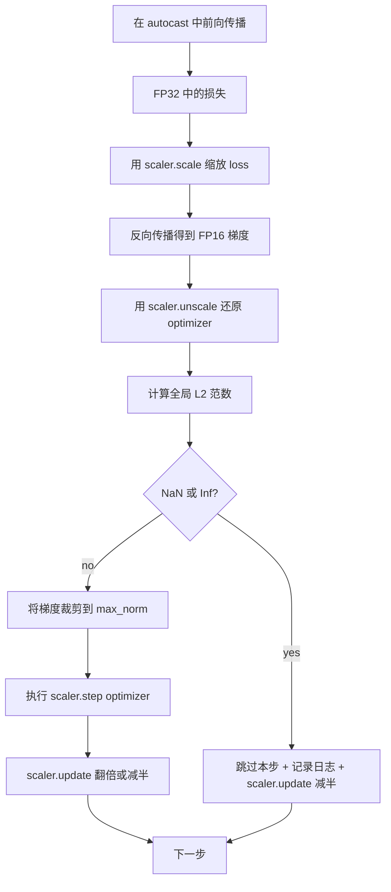

# 梯度裁剪与混合精度

> 上一课中的优化器和调度默认梯度是正常的，但现实通常并非如此。一次坏批次就可能让梯度范数暴涨三个数量级。混合精度（mixed precision）训练又会在损失侧引入 FP16 溢出，把问题进一步放大。本课将构建生产训练不可或缺的两条安全带：把梯度裁剪（gradient clipping）到配置好的全局 L2 范数（global L2 norm），以及一个带有 autocast 和 GradScaler 的混合精度循环，它能够检测 NaN 与 Inf、干净地跳过本步，并记录缩放因子供事后分析。

**类型：** 构建
**语言：** Python
**先修要求：** 第 19 阶段第 30-37 课
**耗时：** ~90 分钟

## 学习目标

- 计算所有参数梯度上的全局 L2 范数，并在其超过配置阈值时原地裁剪。
- 用 autocast 加 GradScaler 包裹一次训练步，使 FP16 前向和反向传播在溢出情况下仍能存活。
- 检测损失或梯度中的 NaN 与 Inf，跳过优化器步，并记录跳过事件。
- 每一步都报告 GradScaler 的缩放因子，让连续多次跳过能立刻被看见。

## 问题

昨天还跑得很干净的训练，今天在第 8,217 步时损失曲线突然直冲天际。元凶是某一个批次，它的梯度范数达到 4,200，是此前峰值的二十倍。不做裁剪时，优化器会施加一次更新，把模型在过去一小时学到的内容全部重置掉。若把全局 L2 裁剪阈值设为 1.0，同一个批次只会贡献一个单位范数的更新；损失会继续沿趋势线前进；训练得以幸存。

混合精度训练通过用 FP16 计算前向传播以及大部分反向传播，把吞吐量提高到 2-3 倍。代价是 FP16 的指数范围很窄。一个在 FP16 中溢出的典型梯度会变成 Inf，随后在后续层里传播成 NaN，并在下一次优化器步把每个权重都写成 NaN。PyTorch 的 GradScaler 通过在反向传播前先用一个较大的缩放因子乘上损失、再在优化器步之前用同样的因子把梯度除回来来解决这一点。如果在 unscale 时任何梯度是 Inf 或 NaN，scaler 就会跳过这一步并把缩放因子减半；如果之前连续 N 步都很干净，scaler 就会把因子翻倍。随着训练推进，这个因子会找到 FP16 范围所允许的最高值。

构建难点在于把这两件事正确接线。若在 unscale 之前裁剪，阈值作用在已缩放的梯度上；若在 unscale 之后裁剪，则 GradScaler 的操作顺序就非常关键。正确顺序是：`scaler.scale(loss).backward()`，然后 `scaler.unscale_(optimizer)`，再 `clip_grad_norm_`，再 `scaler.step(optimizer)`，最后 `scaler.update()`。任何其他顺序都会得到一个悄悄坏掉的循环。

## 概念



### 全局 L2 范数

全局 L2 范数是把所有梯度拼接成一个向量后的欧几里得范数，而不是逐参数范数。PyTorch 通过 `torch.nn.utils.clip_grad_norm_(parameters, max_norm)` 实现它。该函数返回裁剪前的范数，因此本课可以同时记录自然值与裁剪后的值，这对诊断“我们是否每一步都在裁剪”是必须的。

### autocast 与 GradScaler

`torch.amp.autocast(device_type)` 是一个上下文管理器，它会有选择地让符合条件的操作（大多数矩阵乘法类操作）以 FP16 运行。`torch.amp.GradScaler(device_type)` 是一个辅助器，会在反向传播前缩放损失，并在优化器步前对梯度做反向缩放。两者是成对设计的；只用其中一个而不用另一个，是测试应当抓住的配置错误。

本课使用 CPU autocast，因为 CI 里运行的是它；只要把 `device_type="cpu"` 改成 `device_type="cuda"`，同样的模式就能原样迁移到 CUDA。CPU 上的 GradScaler 只是一个桩实现（CPU autocast 默认已经以 BF16 运行，不需要损失缩放），但本课仍保留这些调用点，使接线方式与 GPU 循环完全一致。

### NaN 与 Inf 检测

检测发生在两个位置。首先，在反向传播之前会用 `torch.isfinite` 检查损失本身；Inf 或 NaN 的损失不会产生有用梯度，因此会在进入优化器之前就被跳过。其次，在 `scaler.unscale_(optimizer)` 之后，本课会用 `has_non_finite_grad(...)` 扫描未缩放的梯度，任何 Inf 或 NaN 都会被当作一次跳过。两次检查共同覆盖了前向传播和反向传播两类失效模式。

### 缩放因子诊断

缩放因子是 GradScaler 的内部状态。每一步里，本课都会调用 `scaler.get_scale()`，并把它与学习率和梯度范数一起记录。健康的运行会显示缩放因子按 2 的幂持续上升，直到在 `2^17` 或 `2^18` 左右饱和。行为异常的运行则会让该因子在高低值之间来回振荡，这说明模型梯度有时落在可表示范围内，有时又不在。若不记录，这个诊断信号就完全不可见。

## 动手实现

`code/main.py` 实现了：

- `clip_global_l2_norm` - 对 `torch.nn.utils.clip_grad_norm_` 的封装，同时返回裁剪前与裁剪后的范数。
- `has_non_finite_grad` - 一个扫描梯度中的 NaN 与 Inf 的辅助函数。
- `AmpTrainState` - 把模型、`AdamW` 优化器、GradScaler 和 autocast 设备封装起来。暴露一个 `step(inputs, targets)`，执行完整的裁剪、缩放以及遇到 NaN 就跳过的流水线。
- `StepLog` 和 `SkipLog` - 结构化的逐步记录。
- 一个演示：训练一个小型 `nn.Linear` 模型 20 步，在第 5 步人为向梯度中注入一个 Inf，以走通跳过路径，并打印最终日志。

运行：

```bash
python3 code/main.py
```

脚本会以零状态码退出，并打印逐步日志；每行都会标记为 `STEP` 或 `SKIP`，且至少会有一行是 `SKIP`。

## 生产模式

有四种模式可以把这个循环提升为生产训练步。

**把跳过计数器当成告警，而不是日志行。** 每次训练运行中少量跳过是健康的；每个 epoch 出现数百次跳过则是硬告警：模型已经进入 FP16 无法承受的区域，而循环正在悄悄失效。本课会跟踪一个 1,000 步滚动跳过率；在生产中，若该比率超过 5%，就应触发告警。

**裁剪阈值放在配置里。** `max_norm = 1.0` 是语言模型训练的现代默认值。先在小模型上扫描它；更大的阈值让模型更能从真正困难的批次中恢复；更小的阈值则以更嘈杂的损失曲线为代价，换来更严格的最坏情况约束。这个阈值应与第 44 课中的调度一起，放进同一个 YAML 或 JSON 配置里。

**把范数日志与调度一起写入同一个 CSV。** CSV 列应为 `step, lr, grad_l2_pre_clip, grad_l2_post_clip, loss, skipped, skip_reason, scaler_scale`。评审者打开文件时，就能在同一行里看到调度、梯度变化、缩放因子以及跳过结果（和原因）。把这些列拆到多个文件中，只会制造错位分析。

**即使跳过，也要每一步都运行 `scaler.update()`。** 在正常步里，scaler 会读取自身的无 Inf 计数器、将其加一，并可能把因子翻倍；在跳过步里，scaler 会把因子减半并重置计数器。若在跳过路径忘记 `update()`，就会得到“缩放因子从来没变过”这种 bug。

## 使用它

生产实践：

- **autocast 设备必须与优化器设备匹配。** GPU 训练用 `torch.amp.autocast(device_type="cuda")`；CPU 训练用 `torch.amp.autocast(device_type="cpu")`。设备混用会产生一种沉默的类型错误：损失曲线看起来正常，但模型其实没有在学习。
- **在 backward 之前检查损失。** `torch.isfinite(loss).all()` 只是一轮张量归约；成本可以忽略，但一旦损失是 NaN，它节省下来的就是整整一个训练步。务必执行。
- **在 `zero_grad` 中使用 `set_to_none=True`。** 这会把梯度设为 `None` 而不是零，从而让优化器跳过未受影响参数组的计算。这个设置是“白捡”的吞吐提升，也能略微缩小 bug 暴露面。

## 交付它

在真实项目中，`outputs/skill-clip-amp.md` 会说明：训练步使用了哪个裁剪阈值和 autocast 设备、逐步 CSV 在版本控制中的位置，以及生产环境里对跳过率设置的告警阈值。本课交付的是引擎。

## 练习

1. 把合成的 Inf 注入替换成真实的损失尖峰（把某个批次的目标乘以 `1e8`），并验证跳过路径会被触发。
2. 增加一个 `--bf16` 模式，把 autocast 从 FP16 切换到 BF16。BF16 的指数范围比 FP16 更宽，很少需要损失缩放；验证在同一个演示上，跳过率会降到零。
3. 增加一个单元测试，验证在没有发生裁剪时，梯度裁剪封装器会正确返回裁剪前与裁剪后的范数。
4. 增加一个滚动窗口跳过率计算，以及一个 CLI 标志：当该比率连续 100 步超过配置阈值时，让运行失败。
5. 把该循环接上规范 CSV（`step, lr, grad_l2_pre_clip, grad_l2_post_clip, loss, skipped, skip_reason, scaler_scale`）的写入，并确认文件在每行刷新后能经受住 Ctrl-C。

## 关键术语

| 术语 | 人们常说 | 实际含义 |
|------|----------|----------|
| 全局 L2 范数 | “裁剪目标” | 所有可训练参数梯度拼接后向量的欧几里得范数 |
| autocast | “混合精度” | 在 `with` 代码块内，对符合条件的操作选择性使用 FP16（或 BF16）执行 |
| GradScaler | “损失缩放器” | 在反向传播前放大损失、并在优化器步前对梯度做反向缩放的辅助器 |
| 跳过 | “坏步” | 因梯度或损失非有限而被拒绝的优化器步；scaler 会将因子减半 |
| 缩放因子 | “scaler 状态” | GradScaler 当前的乘数；在一段连续干净步之后翻倍，每次跳过时减半 |

## 延伸阅读

- [Micikevicius et al., Mixed Precision Training (arXiv 1710.03740)](https://arxiv.org/abs/1710.03740) - 最初提出损失缩放的论文
- [Pascanu, Mikolov, Bengio, On the difficulty of training recurrent neural networks (arXiv 1211.5063)](https://arxiv.org/abs/1211.5063) - 梯度裁剪的参考论文
- [PyTorch torch.amp.GradScaler](https://docs.pytorch.org/docs/stable/amp.html) - 本课封装的 scaler API
- [PyTorch torch.nn.utils.clip_grad_norm_](https://docs.pytorch.org/docs/stable/generated/torch.nn.utils.clip_grad_norm_.html) - 本课使用的裁剪原语
- 第 19 阶段 · 42 - 其语料为本循环提供输入的下载器
- 第 19 阶段 · 43 - 本循环消费的数据加载器
- 第 19 阶段 · 44 - 与本循环组合的调度
