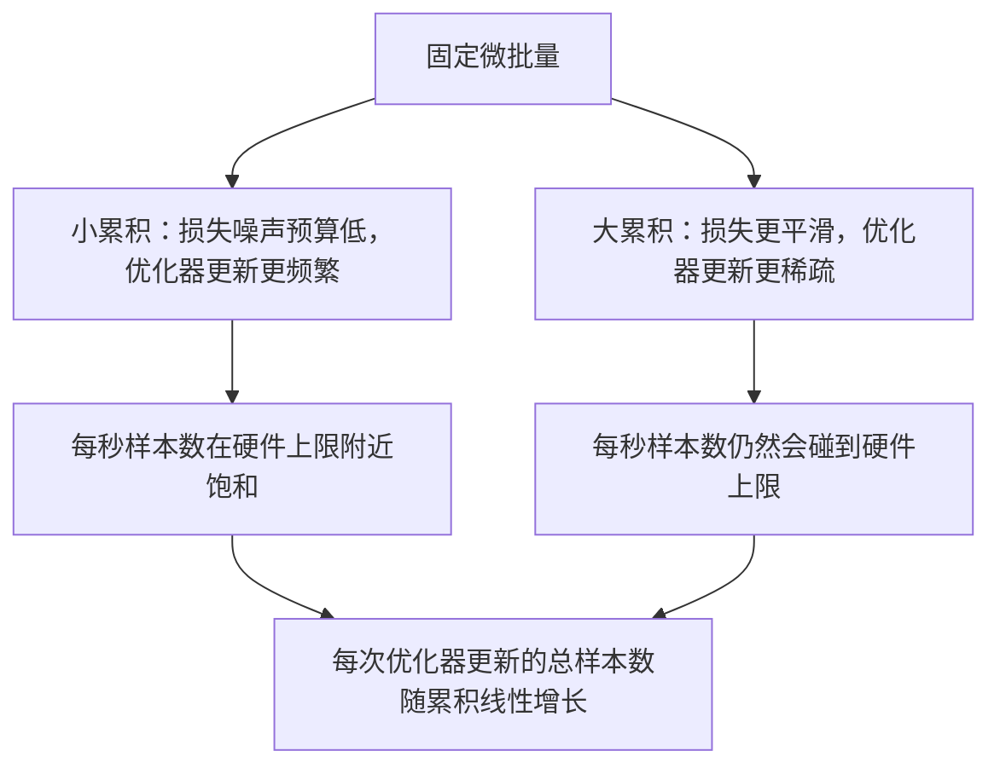

# 梯度累积（Gradient Accumulation）

> 以你本来负担不起的有效批量（effective batch）进行训练，一次只处理一个微批量（micro-batch）。缩放损失，暂缓优化器更新，让梯度逐步累积。

**类型：** 构建
**语言：** Python
**前置课程：** 第 19 阶段第 42 到 45 课
**耗时：** ~90 分钟

## 学习目标

- 推导有效批量恒等式：`effective_batch = micro_batch * accum_steps`。
- 实现按微批量缩放损失，使累积后的梯度与一次完整大批量反向传播一致。
- 在最后一个微批量之前跳过优化器同步（optimizer synchronization）（仅最后一步同步）。
- 阅读吞吐量与有效批量之间的曲线，并解释收益递减。

## 问题

你希望用 512 的有效批量进行训练，因为这样损失曲线更平滑，优化器更新在这个尺度上也更有意义。桌上的加速器在显存耗尽前只能容纳 32 个样本。批量翻倍不可行，把模型减半也不可行。这个领域在 2017 年找到、此后一直沿用的技巧，就是先运行 16 次反向传播，让梯度在参数缓冲区中累积，只有计数达到目标时才更新优化器。

风险在于，损失不再和大批量时是同一个数值。把 16 个小批量（mini-batch）的交叉熵（cross entropy）直接相加，会得到一次完整大批量损失的 16 倍。不做缩放时，梯度方向是对的，但梯度幅值是错的，优化器更新会大 16 倍。修复方法只是一除。也正因为太简单，所以很容易忘。

## 概念


规则很简单：

- 每个微批量的损失在 `backward()` 之前都要除以 `accum_steps`。PyTorch 默认会把梯度累加到 `param.grad` 中；这个除法会把运行中的梯度和拉回到正确的尺度。
- 优化器更新只会在每个有效批量结束时触发，也就是最后一个微批量反向传播之后。在累积中途更新，会把后续整个训练依赖的参数都带偏。
- 优化器状态（动量缓冲区、Adam 矩）是按每个有效步推进一次，而不是按每个微批量推进一次。否则指数滑动平均会看到错误的更新频率，并过早消耗掉调度。
- 在单设备上，这只是记账问题。在多 rank 集群上，同样的模式会把非最终微批量包在 `no_sync` 上下文里，从而跳过梯度 all-reduce；最后一个微批量会一次性归约完整的累积梯度，而不是为 N 个微批量各付一次网络开销。

### 代码中的等价性证明

```python
loss = criterion(model(x_full), y_full)
loss.backward()
opt.step()
```

等价于

```python
for x, y in chunks(x_full, y_full, n):
    scaled = criterion(model(x), y) / n
    scaled.backward()
opt.step()
```

除了浮点数求和顺序不同之外，两者是等价的。循环结束时的累积梯度缓冲区，与一次完整大批量反向传播产生的张量相同。课程代码在 `equivalence_check` 中用最大绝对差小于 1e-4 来断言这一点。

### 成本花在哪里

每个微批量都要做一次前向和一次反向。有了梯度累积，你是在用时间换内存。`outputs/accum-curve.json` 中的吞吐量曲线展示了在固定微批量下，有效批量增长时会发生什么：



没有免费的午餐。`accum_steps` 翻倍，就会让每次优化器更新的墙钟时间翻倍。变化的是梯度估计的方差：在相同墙钟预算下，你做的优化器更新更少了，但每次更新都在更多样本上取了平均。文献通常把大批量和小批量视作不同的优化问题；这一课关注的是机械实现，而不是统计性质。

## 动手构建

`code/main.py` 是可运行的产物。它做三件事。

### 第 1 步：等价性检查

`equivalence_check()` 构建同一个网络的两个副本，并使用相同随机种子。一个副本一次前向处理 16 个样本的批量。另一个副本看到的是四个 4 样本分块，并把损失除以四。这个函数会在优化器更新前比较梯度缓冲区，在更新后比较参数。断言条件是 `max_abs_diff < 1e-4`。

### 第 2 步：仅最后一步同步模式

`train_one_optimizer_step` 会遍历微批量。除最后一个微批量外，它都会进入 `no_sync_context(model)`。在单进程上，这个上下文什么都不做；在 DDP 中，这就是跳过梯度 all-reduce 的位置。不管运行环境如何，记账方式都一样。`sync_counter` 会记录我们离开 no_sync 作用域的次数；对 N 个微批量来说，每个有效步只应计数一次，而不是 N 次。

### 第 3 步：吞吐量曲线

`sweep_effective_batches` 用固定微批量和一组累积步数运行同一个模型。对每种设置，它会记录：

- `samples_per_sec`：看到的总样本数除以墙钟时间
- `median_step_ms`：每个有效步耗时的第 50 百分位数
- `sync_calls`：发生过的集合通信点数量
- `avg_loss`：本次 sweep 中各优化器更新步骤的平均损失

输出会落到 `outputs/accum-curve.json`，并可在 notebook 中复用。

运行：

```bash
python3 code/main.py
```

脚本会先打印等价性差值，再打印 sweep 表格，最后打印 JSON 路径。退出码为 0。

## 如何使用

在生产训练中，梯度累积通常藏在一个旋钮后面。PyTorch 的常见写法是 `accumulation_steps = effective_batch // (micro_batch * world_size)`。你在这里不允许使用的那些框架，封装的其实也是同一个循环；步骤完全一致：缩放损失、在非最终微批量上跳过同步、累积、只更新一次。

真实环境里常见的三种模式：

- 微批量大小会被选到刚好吃满设备内存。更小会浪费加速器周期，更大会直接崩溃。
- 有效批量来自学习率调度。更大的有效批量需要按比例放大学习率并配合 warmup；这就是自 2017 年以来一直在讲的线性缩放法则。
- 累积次数是连接两者的桥梁，也是你唯一能在运行时调优、而不必重写数据加载器的旋钮。

## 交付

`outputs/skill-gradient-accumulation.md` 记录了这套配方，方便同伴把它直接带进新仓库：按 `accum_steps` 缩放损失、在非最终微批量上跳过优化器同步、每个有效批量只更新一次优化器，并把吞吐量相对于有效批量记录成 JSON，让这种权衡清晰可见。

## 练习

1. 用 `--num-steps 100` 重新运行 sweep，并绘制每秒样本数相对于有效批量的曲线。曲线从哪里开始变平？
2. 添加一个错误缩放变体（不做除法），并展示它在第 1 步时相对参考实现的参数差异。
3. 把 SGD 换成 AdamW，并确认优化器状态是每个有效步推进一次，而不是每个微批量推进一次。
4. 引入真正的 `DistributedDataParallel` 包装器，并把 `no_sync_context` 路由到它的方法上。确认每个有效批量的 `sync_calls` 会减少 N-1。
5. 修改等价性检查，让它比较两种不同的微批量切分（2×8 对比 4×4），并解释为什么可能需要放宽容差。

## 关键术语

| 术语 | 常见说法 | 实际含义 |
|------|----------|----------|
| 微批量（Micro batch） | 你拿去做前向的那批数据 | 单次前向传播时能放进内存的那一片数据 |
| 累积步数（Accum steps） | 每次更新前做多少次反向 | 一次优化器更新前累计了多少次反向传播 |
| 有效批量（Effective batch） | 那个“批量” | 微批量 × 累积步数 × 数据并行 world size |
| 损失缩放（Loss scaling） | 除以 N | 对每个微批量做除法，使梯度和与完整批量一致 |
| 最后一步同步（Sync on last） | 其他都跳过 | 只在窗口内最后一次反向传播时执行梯度集合通信 |

## 延伸阅读

- 阅读 PyTorch 关于 `DistributedDataParallel.no_sync` 的文档，了解“仅最后一步同步”技巧的生产级版本。
- Goyal 等人在 2017 年关于大批量训练线性缩放的论文，这是你需要关心有效批量的经典原因。
- 阅读 PyTorch issue tracker 中关于梯度累积与混合精度反缩放相互作用的讨论。
- 第 19 阶段第 42 到 45 课介绍了本课默认你已经具备的模型、数据加载器、优化器和训练器脚手架。
- 第 19 阶段第 47 课讲解检查点与恢复，这样长时间的累积训练不会因为墙钟上限而中断。
