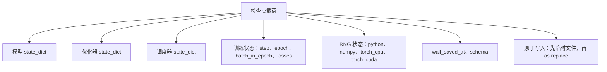
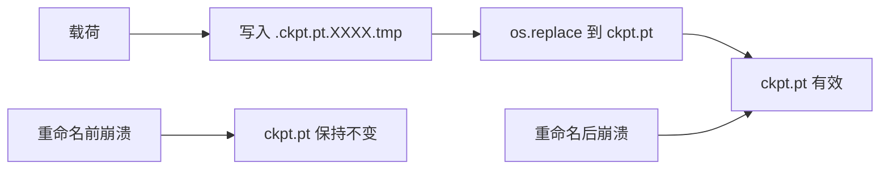
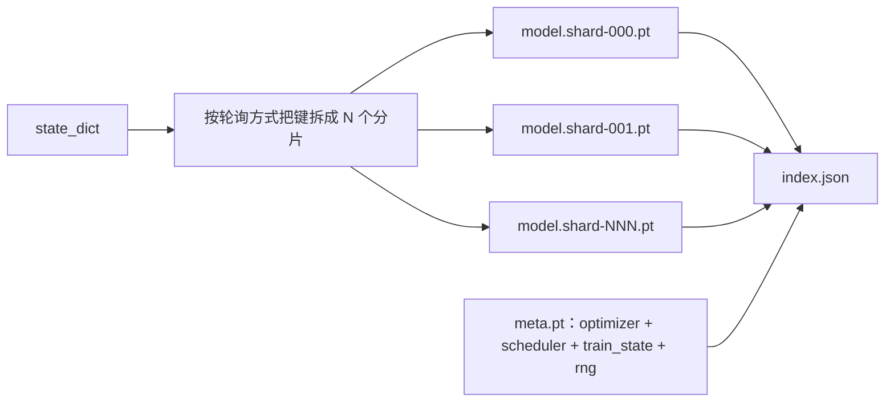

# 检查点保存与恢复（Checkpoint Save and Resume）

> 训练中断会终止整个运行；检查点（checkpoint）能让它继续。以原子方式保存模型、优化器、调度器、损失历史、步数计数器和 RNG 状态，这样任何时刻被杀掉，磁盘上都仍然会留下一个有效文件。

**类型：** 构建
**语言：** Python
**前置课程：** 第 19 阶段第 42 到 45 课
**耗时：** ~90 分钟

## 学习目标

- 把完整训练状态捕获到一个可在全新进程中重新加载的单一载荷里。
- 实现“先写临时文件再重命名”的原子保存（atomic save），确保崩溃时不会留下半写入文件。
- 恢复 Python、NumPy 和 PyTorch 的 RNG 状态，使恢复后的损失与不中断基线一致。
- 为无法再装入单个文件的模型构建分片检查点（sharded checkpoint）布局，并配备哈希校验的分片与 JSON 索引。

## 问题

你设置了一个 18 小时的训练任务。墙钟上限只有 4 小时。集群在第 11 小时重启了，因为某个薪资等级比你高的人批准了内核升级。没有检查点，你就得从头开始。没有恢复机制，你还会丢掉优化器状态——那是前 11 小时才“学”出来的东西——所以即使模型权重还在，AdamW 的矩也没了，下一步会朝训练轨迹早已走过的方向猛地偏过去。

正确的产物应该是一个单文件，里面装着继续训练所需的一切：模型参数、优化器状态、调度器状态、用于画图的损失历史、当前 step / epoch / epoch 内 batch 计数，以及每一种随机来源的 RNG 状态。没有 RNG 状态，恢复后的损失曲线就是另一条曲线。同一个模型，同一份数据，不同的打乱顺序，不同的 dropout 掩码，监控面板上就会出现不同的数字。

原子保存是这个契约的另一半。直接写入最终文件名，意味着在写到一半时崩溃会留下损坏文件；恢复时读到的就是垃圾。先在同一目录下写入临时文件，再重命名，意味着如果写到一半时崩溃，之前那个可用文件仍然完好无损。在 POSIX 文件系统上，重命名是原子的。

## 概念



### 五类状态桶

| 状态桶 | 为什么重要 |
|--------|------------|
| 模型 | 权重和缓冲区；它定义了模型“是什么”。 |
| 优化器 | 动量和自适应矩；没有这些，下一步就是另一个优化问题。 |
| 调度器 | 学习率当前位于曲线的什么位置；尤其余弦调度非常依赖这一点。 |
| 训练计数器 | Step、epoch、epoch 内 batch，以及绘制监控面板所需的损失历史。 |
| RNG 状态 | 为 dropout、数据打乱以及模型内部任何采样提供可复现性。 |

### 原子保存



有两条规则。第一，临时文件必须和目标文件放在同一目录，这样重命名才发生在同一文件系统内；跨设备重命名不是原子的。第二，临时文件名在每次尝试时都必须唯一，这样两个写入者不会互相覆盖。

### 分片检查点

当模型变大后，单文件载荷会变得过于庞大：加载不够快，不便检查，而且一旦网络共享盘在读取中途抖一下，后果就很糟。修复方法是把参数状态拆成多个分片，再写一个小索引把它们串起来。



索引会记录分片数量、每个分片的 sha256，以及 meta 文件的 sha256。任何哈希不匹配时，加载器都会高声失败。分片可以落到不同的物理磁盘上；meta 很小，而且会最先被读取。

### 在 epoch 中途继续恢复

如果恢复总是跳到下一个 epoch 的开头，就会浪费几分钟到一天不等的工作量。修复方法是保存 `(epoch, batch_in_epoch)` 再加上 RNG 状态。加载后，训练循环会把随机数生成器快进到当前 epoch 中已消费过的 batch 之后，然后从 `batch_in_epoch` 继续。课程代码就是这么做的；它断言恢复之后的损失轨迹与不中断基线相比，在 1e-4 范围内一致。

## 动手构建

`code/main.py` 提供了四个基础原语和一个演示驱动。

### 第 1 步：捕获并恢复 RNG 状态

`capture_rng_state` 会返回一个字典，包含 Python 的 `random.getstate`、NumPy 的 `np.random.get_state`，以及 PyTorch CPU 和 CUDA 的 RNG 字节。`restore_rng_state` 会把它反向恢复。CPU 张量是一个 uint8 字节缓冲区，PyTorch 的 RNG 知道如何消费它。

### 第 2 步：原子保存

`atomic_save` 会先把载荷写到目标目录中的临时文件，再通过 `os.replace` 把它替换成最终名称。`atomic_write_json` 会对分片索引做同样的事。

### 第 3 步：完整检查点往返

`save_checkpoint` 会把模型、优化器、调度器、训练状态和 RNG 打包成一个字典。`load_checkpoint` 则反向恢复它，并返回一个 `TrainState`。`schema` 字段就是升级钩子：未来格式变更时，会提升版本字符串，再由加载器分派处理。

### 第 4 步：分片变体

`save_sharded_checkpoint` 会把参数键按轮询方式分配到 N 个分片，为每个分片各自做原子保存，写入包含优化器、调度器和训练状态的 meta 文件，再写入带有分片 sha256 的 JSON 索引。`load_sharded_checkpoint` 会在合并之前校验每一个分片。

### 第 5 步：恢复演示

`run_resume_demo` 会先训练一个小模型共 `total_steps` 步，在 `interrupt_at` 时保存检查点，然后继续运行。第二个进程会恢复该检查点，并跑完剩余步骤。这个函数返回中断点之后两段损失轨迹的最大绝对差。恢复 RNG 后，这个差值要么是 0，要么只是浮点噪声。

运行：

```bash
python3 code/main.py
```

单文件和分片两种演示都会断言最大差异小于 1e-4。汇总结果会落到 `outputs/resume-demo.json`。

## 如何使用

生产训练栈会把检查点机制作为训练器的一部分交付。整体形状不变：模型 + 优化器 + 调度器 + 计数器 + RNG，采用原子写入，并按 step 命名，方便找到最新文件。分片布局为大型模型提供并行读取；而 `index.json` 正是支撑这一点的关键。

有三种模式必须强制执行：

- **`schema` 是载荷中的字符串。** 迁移逻辑要基于它分支。没有它，你就无法在不破坏旧运行的前提下演进格式。
- **对每个分片计算 sha256。** 被静默截断的下载是最糟糕的 bug；加载器要么尽早失败，要么就会很晚才失败。
- **让检查点保存频率保持诚实。** 每 N 步保存一次，每过固定墙钟分钟数也保存一次，两者取更短间隔。否则那一步很长、最后又崩掉时，就会浪费整整一个保存窗口的工作。

## 交付

`outputs/skill-checkpoint-save-resume.md` 是适用于任何新训练脚本的配方：载荷形状、原子写入、RNG 捕获、分片索引。把这项技能放进仓库，在周期性保存位置接入 `save_checkpoint`，在启动时接入 `load_checkpoint`，训练就能扛住中断。

## 练习

1. 把轮询式分片替换成按参数组分片（以 `.weight` 结尾的层 vs `.bias`）。什么时候各自更合适？
2. 扩展保存循环，让它保留最近 K 个检查点并清理更旧的文件。磁盘很小时，合适的 K 应该是多少？
3. 添加一个 `--ckpt-every-seconds` 标志，让保存按墙钟时间间隔触发，而不仅是按 step 数。
4. 添加一个启动时的校验路径，扫描目录下每个检查点，并报告哪些已经损坏。
5. 实现 `migrate_v1_to_v2` 函数，为载荷添加一个新字段并提升 `schema` 字符串。让加载逻辑同时兼容两个版本。

## 关键术语

| 术语 | 常见说法 | 实际含义 |
|------|----------|----------|
| 原子保存（Atomic save） | “写了就祈祷” | 在同一目录下先写临时文件，再用 `os.replace` 写入目标名称 |
| 状态字典（State dict） | “那些权重” | 以参数名为键的模型参数和缓冲区 |
| 分片检查点（Sharded checkpoint） | “大模型文件” | 多个文件，每个分片一个，外加一个 meta 文件和带 sha256 的 JSON 索引 |
| RNG 状态（RNG state） | “随机种子” | python random、numpy、torch CPU、torch CUDA 的捕获状态；不只是种子 |
| Epoch 中途恢复（Mid-epoch resume） | “重启” | 快进 RNG，并从同一 epoch 的下一个 batch 继续 |

## 延伸阅读

- 阅读 POSIX 的 `rename` 语义，理解 `os.replace` 所依赖的原子性保证。
- 阅读 PyTorch 关于 `torch.save` 和 `torch.load` 的文档，包括跨设备恢复时使用的 `map_location`。
- 第 19 阶段第 46 课介绍了本课检查点载荷要跨越保存的梯度累积。
- 第 19 阶段第 48 课介绍了这套方案所适配的分布式包装器及其 state dict 格式。
- 阅读 Linux 内核关于 `fsync` 的文档，理解原子重命名背后的持久性保证。
