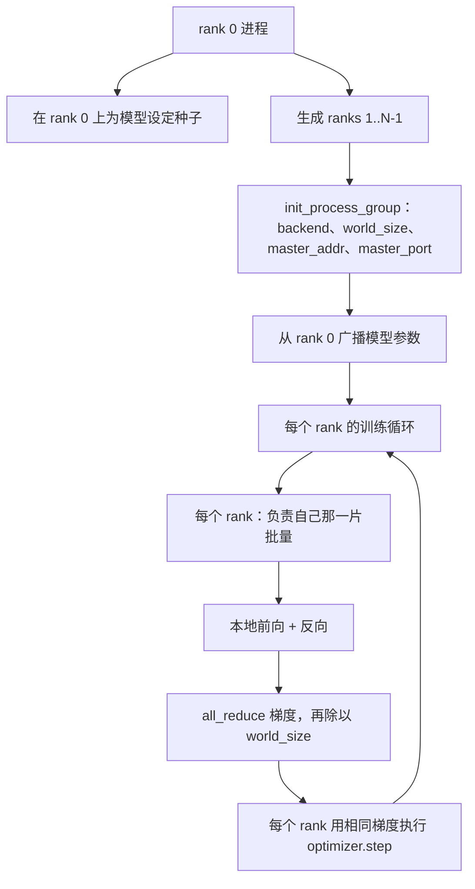
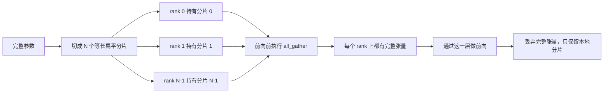

# 从零实现分布式数据并行（Distributed Data Parallel, DDP）与完全分片数据并行（Fully Sharded Data Parallel, FSDP）

> 多 rank 训练归根结底就是两种集合通信（collective）和一条规则。启动时广播参数，反向传播后平均梯度，绝不要让各个 rank 对自己正处于哪一步产生分歧。

**类型：** 构建
**语言：** Python
**前置课程：** 第 19 阶段第 42 到 45 课
**耗时：** ~90 分钟

## 学习目标

- 使用 `gloo` 后端在 N 个 rank 之间拉起进程组（process group），无需特殊硬件。
- 实现一个最小化 DDP 包装器：构造时广播参数，反向传播后对梯度做 all-reduce。
- 证明各 rank 梯度做 all-reduce 后，和单进程在拼接输入上得到的梯度一致。
- 勾勒 FSDP 参数分片：每个 rank 只持有一个切片，前向传播时聚合出完整张量，之后再丢弃。

## 问题

模型能放进一台设备。数据集放不进。优化预算要求你每秒看到 N 倍数量的样本。第一根杠杆是数据并行（data parallel）：每个 rank 在批量的不同切片上运行同一个模型，然后在优化器更新前对梯度取平均。第二根杠杆是 FSDP：模型本身也放不进单台设备，于是每个 rank 只持有每个参数的一部分，并在前向传播时按层重建完整张量。

真正痛苦的是记账。如果参数在不同 rank 之间漂移，整个运行会在静默中损坏。如果你平均了梯度却没平均损失，监控面板就在撒谎。如果集合通信后端（collective backend）无法在拓扑上达成一致，运行就会永久挂起。修复方法就是亲手把这些集合通信写一遍，从此不要盲信任何你自己复现不出来的封装器。

这一课运行在 CPU 上，不假设 CUDA。`gloo` 后端随每个 PyTorch 构建一起发布，并支持 `torch.multiprocessing` worker；同样的代码切到多 GPU 节点时，只要不改结构，把后端换成 `nccl` 即可。

## 概念



### 两种最关键的集合通信

| 集合通信 | 它做什么 | 何时使用 |
|----------|----------|----------|
| `broadcast` | 把一个张量从某个 rank 复制到所有其他 rank | 参数初始化、调度器状态、任何一对多同步 |
| `all_reduce` | 在所有 rank 间对一个张量求和（或均值、最大值），每个 rank 都会得到结果 | 反向传播后对梯度取平均 |
| `all_gather` | 每个 rank 贡献一个张量，每个 rank 都拿到拼接后的结果 | 收集 logits、FSDP 参数反分片 |

DDP 的契约是：构造时 `broadcast`，反向传播后 `all_reduce`。FSDP 草图则是在每一层前向传播之前额外加上 `all_gather`。

### 梯度平均与单进程梯度一致

当一个模型在 N 个 rank 上、每个 rank 处理 B 个样本时训练，它产生的梯度必须与单进程在 N*B 个样本上训练得到的梯度相同。关键点在于，把每个 rank 的梯度求和再除以 N，得到的就是平均损失对应的梯度；这正是对完整批量使用均值归约的交叉熵会产生的结果。课程代码会断言：手写 all-reduce 梯度与参考单进程梯度之间的 `max-abs-diff < 1e-3`。

### FSDP 草图



它带来的内存收益是精确的：每个 rank 的参数内存降到原来的 1/N。代价是每次前向传播都要做 gather。生产级 FSDP 会把 gather 与前一层的计算重叠起来，所以墙钟开销远小于朴素估算。课程里会对每个参数都做这次往返，并断言重建结果与原始张量按位完全相等。

### CPU 与 `gloo` 后端

CUDA 是生产目标，但同样的代码路径在 CPU 上也存在。`gloo` 是 CPU 集合通信后端。它在 GPU 上比 `nccl` 慢几个数量级，但 API 表面完全一致。课程里的进程组使用 `backend="gloo"` 初始化，rank 通过 `torch.multiprocessing` 而不是 `torchrun` 拉起；两种方式最终都会落到相同的 `torch.distributed` 调用上。在多 GPU 节点上，唯一的变化只是 `backend="nccl"`、设备张量，以及用 `torchrun` 启动。

## 动手构建

`code/main.py` 是可运行的产物。

### 第 1 步：拉起进程组

```python
os.environ["MASTER_ADDR"] = "127.0.0.1"
os.environ["MASTER_PORT"] = str(port)
dist.init_process_group(backend="gloo", rank=rank, world_size=world_size)
```

`MASTER_ADDR` 和 `MASTER_PORT` 是 rendezvous：每个 rank 都会连接同一台主机上的同一个端口。课程会通过“绑定后关闭”的技巧挑一个空闲端口，以避免多次运行共享同一台机器时发生冲突。

### 第 2 步：构造时广播

`MinimalDDP.__init__` 会遍历每个参数和缓冲区，并调用 `dist.broadcast(tensor, src=0)`。rank 0 的值会成为规范初始化值。没有这一步时，每个 rank 都会按自己的随机种子初始化，模型会从第一步开始分叉。

### 第 3 步：反向传播后 all-reduce 梯度

```python
def all_reduce_grads_(module, world_size):
    for p in module.parameters():
        if p.grad is None:
            p.grad = torch.zeros_like(p.data)
        dist.all_reduce(p.grad.data, op=dist.ReduceOp.SUM)
        p.grad.data.div_(world_size)
```

每个 rank 最终都会得到相同的平均梯度。这样一来，优化器更新在每个 rank 上都变成相同输入的函数，这就是整个运行期间参数能够保持同步的原因。

### 第 4 步：证明等价性

`manual_all_reduce_matches_single_process` 会在 rank 0 上构建同一个模型，并把 all-reduce 之后的梯度与单进程在拼接输入上计算出的梯度进行比较。最大绝对差大约是 1e-8。

### 第 5 步：FSDP 往返

`fsdp_round_trip_sketch` 会把每个参数展平，填充到 `world_size` 的整数倍，切片、all-gather，再去掉填充。每个 rank 重建出的结果都和原始值一致。这就是反分片步骤；其逆过程（前向之后重新分片）只需要从聚合张量中再切一刀。

运行：

```bash
python3 code/main.py
```

默认 world size 是 2。两个 CPU 进程会被拉起，通过 `gloo` 相互通信，并以退出码 0 结束。输出 `outputs/ddp-demo.json` 会记录每个 rank 的参数和、all-reduce 后的梯度范数、FSDP 往返结果，以及手写实现与参考梯度之间的差异。

## 如何使用

生产训练栈调用的其实也是同样的原语。PyTorch 的 `DistributedDataParallel` 额外提供了：反向传播后梯度 hook，可把 all-reduce 与 backward 重叠；分桶 all-reduce，把多个小梯度合并成一次集合通信；以及第 46 课里用过的 `no_sync` 上下文。

PyTorch 的 FSDP 额外提供了：按层的扁平参数视图，让每个 rank 只持有一段连续缓冲区；把下一层的反分片与当前层计算重叠；以及可选的分片 CPU 卸载。

整体形状不变：启动时广播，反向后归约，当参数再也放不下时就对它们做分片。

## 交付

`outputs/skill-distributed-fsdp-ddp.md` 带着一份适用于新训练脚本的配方：CPU 上用 `gloo`、GPU 上用 `nccl` 拉起进程组；用一个在构造时广播、在反向后归约的 DDP 外壳包住模型；如果需要，再用 FSDP 草图中的 `all_gather` 模式对参数做分片。

## 练习

1. 用 `--world-size 4` 运行，并确认整个运行期间参数扩散保持在 1e-3 以内。
2. 把手写平均改成 `dist.all_reduce(op=dist.ReduceOp.AVG)`，并计时比较差异。
3. 给 DDP 包装器添加一个反向传播后 hook，让 all-reduce 与其余 backward 重叠；测量墙钟时间是否改善。
4. 实现 FSDP 的重新分片步骤：前向传播后，再次用本地分片替换完整张量。确认每个 rank 的内存占用下降。
5. 在一台 CUDA 机器上把后端切换为 `nccl`。记录哪些环境变量发生变化，哪些保持不变。

## 关键术语

| 术语 | 常见说法 | 实际含义 |
|------|----------|----------|
| 后端（Backend） | “gloo 或 nccl” | 实现集合通信操作的库；gloo 用于 CPU，nccl 用于 GPU |
| World size | “总 rank 数” | 组内进程数；这个组是集合通信操作的作用单位 |
| Rank | “Worker id” | 组内从 0 开始编号的进程标识符 |
| All-reduce | “把梯度加起来” | 在所有 rank 间对张量求和，每个 rank 最终都拿到相同结果 |
| 反分片（Unshard） | “把参数 gather 回来” | 通过 `all_gather` 用各 rank 的切片重建完整张量 |

## 延伸阅读

- 阅读 PyTorch `torch.distributed` 文档，了解本课依赖的集合通信语义。
- 阅读 `gloo` 库支持的集合通信列表，其形态与 CUDA 支持的 `nccl` 原语一致。
- 第 19 阶段第 46 课介绍了把 DDP 的 all-reduce 包在 `no_sync` 里的梯度累积模式。
- 第 19 阶段第 47 课介绍了能够跨 DDP 和 FSDP 运行存活的检查点布局。
- 阅读 PyTorch FSDP 文档，了解这里勾勒的参数分片方案的生产级实现。
