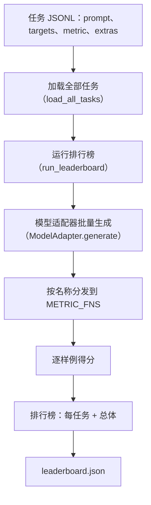
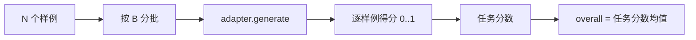

# 语言模型评测框架（Language Model Evaluation Harness）

> 在一个你无法定义的任务上表现良好的模型，往往只是偶然表现好。评测框架（harness）把任务定义、指标、运行器和排行榜整合为一个简短且可替换的结构。

**类型：** 构建
**语言：** Python
**前置课程：** Phase 19 第 42 到 45 课
**耗时：** ~90 分钟

## 学习目标

- 将任务（task）定义为一个 JSONL 文件，并为每个样例包含 `prompt`、`targets`、`metric` 以及可选的 `extras`。
- 实现五种指标（metric）：精确匹配（exact match）、rouge-l F1、可执行检查、选择题和子串包含。
- 构建运行器（runner），按任务对样例分批处理，并分发到可替换的模型适配器（model adapter）。
- 输出排行榜（leaderboard）JSON，其中包含每个任务的分数、延迟，以及可复现的总体平均分。

## 问题

每周都会有新的语言模型发布。营销说法是它表现很好。真正诚实的问题是：它究竟在哪个任务上表现好？真正诚实的答案，是你自己写出来的排行榜，因为厂商的排行榜一定是他们针对性调优过的。

如果你的仓库里没有评测框架，你比较两个模型时靠的是感觉。有了评测框架，你就能在固定任务集、固定指标上，以可对比差异的 JSON 输出，用分数来比较它们。评测框架是昨天运行结果和今天运行结果之间的契约。没有它，回归问题就会被发布出去。

陷阱在于把评测框架过度拟合到单一模型上。解决方式也是反过来规避同一个陷阱：评测框架要小到十五分钟能读完，任务要小到可以直接放进仓库，指标要从零开始编写以便同事审计，而适配器（adapter）则是唯一存放模型特定代码的地方。替换适配器，排行榜会变；替换任务，排行榜也会变。除此之外，别的都不该变。

## 概念



### 任务规范（task spec）

每个样例都是 JSONL 中的一行：

```json
{"id": "arith-00", "prompt": "compute: 2 + 2", "targets": ["4"], "metric": "exact_match"}
```

对于需要额外评分辅助信息的指标，`extras` 携带侧载荷：

```json
{
  "id": "code-00",
  "prompt": "python: write a function f that doubles its input",
  "targets": ["ok"],
  "metric": "code_exec",
  "extras": {"io_pairs": [[1, 2], [3, 6]]}
}
```

一个任务就是 `outputs/tasks/` 下的一个 `.jsonl` 文件。文件名就是任务名。一个文件中的所有样例共享同一种指标。

### 五个固定任务（fixture tasks）

| 任务 | 指标 | 测试内容 |
|------|------|----------|
| arithmetic | exact_match | 在确定性答案上的 token 级正确性 |
| summary | rouge_l | 相对单行参考摘要的最长公共子序列 F1 |
| code-exec | code_exec | 可执行测试：预测出的函数必须满足一组输入输出对 |
| multiple-choice | multiple_choice | 预测结果的首字母必须匹配允许的字母 |
| generation | substring_contains | 自由生成文本必须至少包含一个目标子串 |

### 指标契约（metric contract）

每个指标都是一个从 `(prediction, targets, extras) -> float in [0.0, 1.0]` 的函数。评测框架先对每个样例分数求平均得到任务分数，再对所有任务分数求平均得到总体分数。这些指标函数都很小：

- `exact_match`：转小写、折叠空白、判断相等。
- `substring_contains`：同样标准化后做子串测试。
- `multiple_choice`：将首字符转为大写。
- `rouge_l`：用最长公共子序列长度分别除以预测和参考长度，再对精确率与召回率求 F1。
- `code_exec`：在受限命名空间中执行预测代码，对每个输入输出对调用 `f(x)`，统计匹配数。

`code_exec` 指标会在精简过的 builtins 命名空间里运行预测代码。本课的测试会断言 `import os` 会直接失败，因为命名空间里没有 `os`；你不能通过代码预测访问文件系统。

### 模型适配器（model adapter）

```python
class ModelAdapter(Protocol):
    def generate(self, prompts: Sequence[str]) -> List[str]: ...
    @property
    def name(self) -> str: ...
```

适配器就是那条缝。课程附带了 `ToyAdapter`，它是一个确定性的模式匹配器，能为五个固定任务中的每个提示返回正确答案。真实适配器会调用模型并返回输出。评测框架并不关心是哪一种。

### 运行器（runner）

`run_task` 每次按 `batch_size` 处理一批提示，并把结果交给指标函数。`run_leaderboard` 会遍历每个任务并求平均。`write_leaderboard` 会输出带有 schema 字段的 JSON，这样未来格式变化时就不会悄悄把仪表盘弄坏。



## 构建它

`code/main.py` 是可运行的产物。

### 第 1 步：写入固定任务

`seed_fixture_tasks(target_dir)` 会写出五个 `.jsonl` 文件。第一次运行 `main.py` 时，如果目录为空，就会自动写入这些文件。

### 第 2 步：加载任务

`load_all_tasks(task_dir)` 会读取每个 `.jsonl` 文件，并返回一个从任务名到 `Example` 记录列表的字典。以 `#` 开头的注释行和空行都会被跳过，这样贡献者就能在文件中写注释。

### 第 3 步：实现指标

每个指标都是一个小函数，并有对应的单元测试。课程测试套件包含 13 个用例，覆盖标准化、部分重叠、代码执行和不安全代码拒绝。

### 第 4 步：编写运行器

`run_task` 会迭代各个批次，并产出一个 `TaskResult`，其中包含分数、正确数量、总数量和延迟。`run_leaderboard` 会遍历所有任务，并生成带总体平均分的 `Leaderboard`。

### 第 5 步：输出 JSON

`write_leaderboard` 负责序列化排行榜。`--include-per-example` 标志会额外导出逐样例记录，这样当分数变化时，你就能把本次预测和上一次运行结果做 diff。

运行它：

```bash
python3 code/main.py
```

脚本会在第一次运行时写入固定任务，用 toy adapter 为它们打分（它会把所有固定任务都答对），并写出 `outputs/leaderboard.json`。使用 toy adapter 时，总分是 1.0；`test_main.py` 里的 stub adapter 测试则展示了：当适配器无法回答时，同一个评测框架会得到 0.0。

## 使用它

要接入真实模型，就写一个适配器。结构如下：

```python
class HttpAdapter:
    name = "vendor.v1"

    def __init__(self, endpoint, api_key):
        self.endpoint = endpoint
        self.api_key = api_key

    def generate(self, prompts):
        out = []
        for prompt in prompts:
            response = http_post(self.endpoint, prompt, self.api_key)
            out.append(response["text"])
        return out
```

在 `main()` 开头把 `ToyAdapter` 换成 `HttpAdapter`。评测框架、任务、指标和排行榜都保持不变。

在真实项目中交付这个评测框架时，需要强制执行三条模式：

- **固定任务文件。** `leaderboard.json` 要么携带带哈希锁定的任务内容，要么连同这些 JSONL 一起保存；否则任务文件一改，分数也跟着变，你却分不清到底是什么变了。
- **比较预测，不只比较分数。** `--include-per-example` 标志能让你看到模型在分数下滑那天到底回答了什么。
- **限制批大小。** 真实适配器会有速率限制。较小的批大小能让评测框架在不同厂商之间保持兼容。

## 交付它

`outputs/skill-lm-eval-harness.md` 给出了完整配方：JSONL 任务规范、五种指标、可替换适配器、批处理运行器，以及带 schema 字段的排行榜 JSON。`outputs/tasks/` 中的任务文件就是固定样例；把它们复制到真实项目里，就能作为起步模板。

## 练习

1. 新增第六个任务，并从零开始编写一个自定义指标（BLEU 风格重叠、BLEURT 风格参考评分，或任何契约清晰的东西都可以）。
2. 扩展 `code_exec`，让它能捕获 stdout，并接受一个期望 stdout 列表作为 targets。
3. 增加一个排行榜 diff 命令：给定两个 `leaderboard.json` 文件，打印哪些任务变了、变化幅度是多少。
4. 为每个样例限制延迟。把适配器调用包进超时逻辑，并在排行榜中单独输出一个 `timeouts` 列。
5. 在排行榜里用 sha256 固定任务内容，让未来的读者可以验证自己评测的是同一组任务。

## 关键术语

| 术语 | 人们常说 | 实际含义 |
|------|----------|----------|
| 任务规范（Task spec） | “评测格式” | 一个 JSONL 文件，每个样例包含 prompt、targets、metric 和可选 extras |
| 指标（Metric） | “怎么打分” | 从 (prediction, targets, extras) 到区间 [0, 1] 浮点数的函数 |
| 适配器（Adapter） | “模型客户端” | 带有 `generate(prompts) -> list[str]` 方法的对象；唯一的模型特定代码 |
| 排行榜（Leaderboard） | “记分板” | 含有每任务分数、总数量、延迟和总体平均分的 JSON |
| 代码执行指标（Code exec metric） | “运行一下再检查” | 在受限命名空间中执行预测代码，并与输入输出对进行比对 |

## 延伸阅读

- 生产环境参考实现可看原始的 lm-evaluation-harness：规模更大，但结构相同。
- 如果想看同一契约的另一种实现，可以参考 HuggingFace 的 lighteval。
- Phase 19 第 46 课介绍了训练栈中用到的梯度累积模式，而这个评测框架正是为该训练栈打分。
- Phase 19 第 47 课介绍了你要评测的 checkpoint 格式；记得在排行榜里固定 checkpoint 哈希。
- Phase 19 第 48 课介绍了生成被测模型的分布式训练栈。
