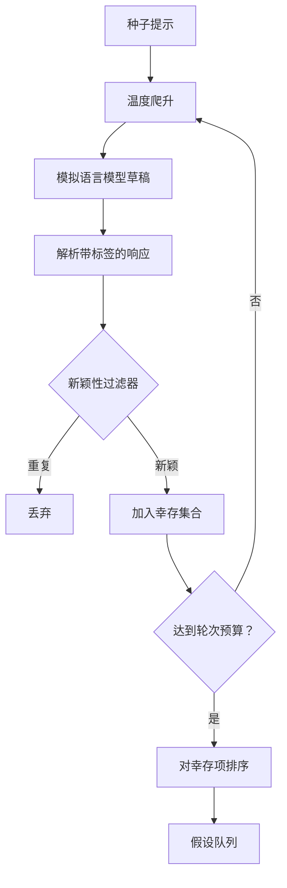

# 假设生成器（Hypothesis Generator）

> 一个研究智能体如果把同一个问题问两遍，就是在浪费 token。诀窍在于强迫每个草稿都落到新的位置上。

**类型：** 构建
**语言：** Python
**前置课程：** Phase 19 Track A 第 20-29 课
**耗时：** ~90 分钟

## 学习目标
- 从种子提示（seed prompt）驱动采样器（sampler），并把输出转成带类型的假设记录。
- 在每一轮提升采样器温度，让下一版草稿比上一版偏离得更远。
- 用一个小型嵌入模型（embedding model）和余弦距离阈值过滤近似重复项。
- 用结合新颖性、具体性和可检验性的评分函数对幸存结果排序。
- 让每一步都保持确定性，这样同样的 seed 总会产出同样的队列。

## 为什么要先生成，再过滤

一个规划器只向一个模型问一次，就只会得到一个假设。这对讲解示例来说没问题。但对研究循环来说，这个形状是错的。循环需要的是一个有深度的排序队列（ranked queue），这样当第一个假设失败时，运行器就能直接拿起下一个，而不必再为一次完整采样付费。

有两个思路结合起来，才能产出这个队列。第一个是温度爬升（temperature ramping）：每次经过采样器时都把温度调高一点，鼓励后面的草稿四处游走。第二个是新颖性过滤（novelty filtering）：每次草稿生成后，生成器都会计算它与先前所有保留下来的草稿之间的嵌入距离，只要落在已有簇内部，就会被拒绝。

本课附带一个模拟语言模型（mock language model），它会对固定提示返回脚本化的 token 序列。这个 mock 足以打通完整路径：输入种子提示、应用温度爬升、解析候选项、执行新颖性过滤、输出排序后的队列。

## 假设（Hypothesis）的结构

```text
Hypothesis
  id             : int           (monotonic within a run)
  text           : str           (the claim)
  variables      : list[str]     (what changes between conditions)
  metric         : str           (what the runner will measure)
  baseline_ref   : str | None    (which paper or run the comparison cites)
  draft_pass     : int           (which sampler pass produced this)
  temperature    : float         (the sampler setting at draft time)
  novelty_score  : float         (distance from prior survivors, 0..1)
  rank_score     : float         (weighted sum used for ordering)
```

`variables` 和 `metric` 不是自由文本。解析器会从带标签的响应中抽取它们。第五十二课中的运行器在构建实验配置时，会直接读取这些字段。

`baseline_ref` 是可选的，但推荐提供。第五十三课中的评估器需要一个基线来做比较。如果假设里没写，评估器就会回退到同一指标上的上一次运行结果。

## 架构



这个循环很直接。有意思的地方在于，每个方框都有硬性契约。

## 温度爬升

从 `t_min` 开始，到 `t_max` 结束，步长为 `(t_max - t_min) / (n_passes - 1)`。每一轮都会用当前温度调用采样器，借助 `GeneratorConfig.schedule()` 生成 `n_passes` 个均匀分布的温度值。mock 模型会根据 `(prompt, temp_bucket)` 切换到一组不同的脚本化响应。温度桶是开区间，所以温度只要有一点变化，就会落入另一个桶，产出不同草稿。在生产环境里，采样器会换成真实模型，并把 `temperature=t` 原样透传。

默认调度是从 `0.2` 到 `1.2` 的六轮。六轮足够把队列填满，同时又不至于为那些最终会被新颖性过滤器拒掉的样本付费。低于 `0.2`，模型往往只是复述种子提示。高于 `1.2`，响应就容易跑题并导致解析失败。

## 新颖性过滤器

每次草稿被解析后，生成器都会为文本做嵌入，并与每个已接受的假设逐一比较。这里的嵌入是一个小型哈希词袋（hashed bag of word tokens），并被标准化为单位长度。两个单位向量之间的余弦距离（cosine distance）是 `1 - dot(a, b)`。如果某个草稿与所有先前幸存项之间的最小距离都大于 `novelty_threshold`，它才会通过。默认值是 `0.25`。

这种哈希嵌入并不花哨。它是确定性的、零依赖的，而且足够抓住最明显的情况：两份草稿共享了大多数名词。生产部署里可以把它替换成一个小型句向量模型。接口不需要变化。

## 排名分数（rank score）

```text
rank_score = w_novelty * novelty_score
           + w_specificity * specificity_score
           + w_testability * testability_score
```

一共三个子分数。`novelty_score` 是与先前幸存项之间的最小嵌入距离。`specificity_score` 是假设中具体变量的数量除以目标数量。`testability_score` 则是：如果假设同时指定了指标和基线，得一分；只指定指标得半分；否则为零。

默认权重是 `0.4`、`0.3`、`0.3`。这些权重放在生成器配置里，这样下游课程要调整它们时，无需 fork 代码。

## 模拟语言模型

```python
class MockLLM:
    def sample(self, prompt: str, temperature: float, seed: int) -> str:
        ...
```

对于给定的 `(prompt, temperature, seed)` 三元组，这个采样器是确定性的。mock 内部维护了一张以 `(prompt_signature, temperature_bucket)` 为键的脚本响应表。如果表里没有对应项，采样器就返回一个会导致解析失败的兜底响应。测试中有一项专门覆盖这个兜底路径。

seed 会被混入响应中，因此同样的 `(prompt, temperature)` 配对，在不同 seed 下会生成不同草稿。在测试里我们固定 seed，以保持结果可复现。在真实部署中，seed 通常来自系统时钟或计数器。

## 输出队列

输出是一个按 `rank_score` 降序排列的 `Hypothesis` 记录列表。第五十二课中的运行器会弹出队首、运行实验，而第五十三课中的评估器会把判定结果写回。如果判定说这个假设是错的，运行器就会继续弹出下一个。

这个队列是有限的。队列耗尽后，编排器（orchestrator）可以选择放宽种子提示并重新运行生成器，或者停止并报告预算耗尽。

## 如何阅读代码

`code/main.py` 定义了 `Hypothesis`、`MockLLM`、`HypothesisGenerator` 以及一个确定性演示。生成器只暴露一个 `run(seed_prompt)` 方法，并返回排序后的队列；轮次数量从 `GeneratorConfig.n_passes` 读取，而不是作为参数传入。嵌入实现是哈希词袋。新颖性过滤器是一个独立函数。排名分数也是一个独立函数。整个实现不依赖 `numpy`；嵌入计算完全基于 stdlib，因此课程可以保持可移植性。

`code/tests/test_generator.py` 覆盖了线性路径、重复拒绝路径、解析失败路径、温度爬升边界以及排序结果。

## 它在整体中的位置

第五十课负责生成队列。第五十一课取出队首并执行文献搜索，以确认或反驳该假设。第五十二课则对同一个队首运行真实实验。第五十三课读取这两部分输出并给出判定。四节课可以组合成一个无人值守的研究循环；当然，人类也可以在任何边界接管。
