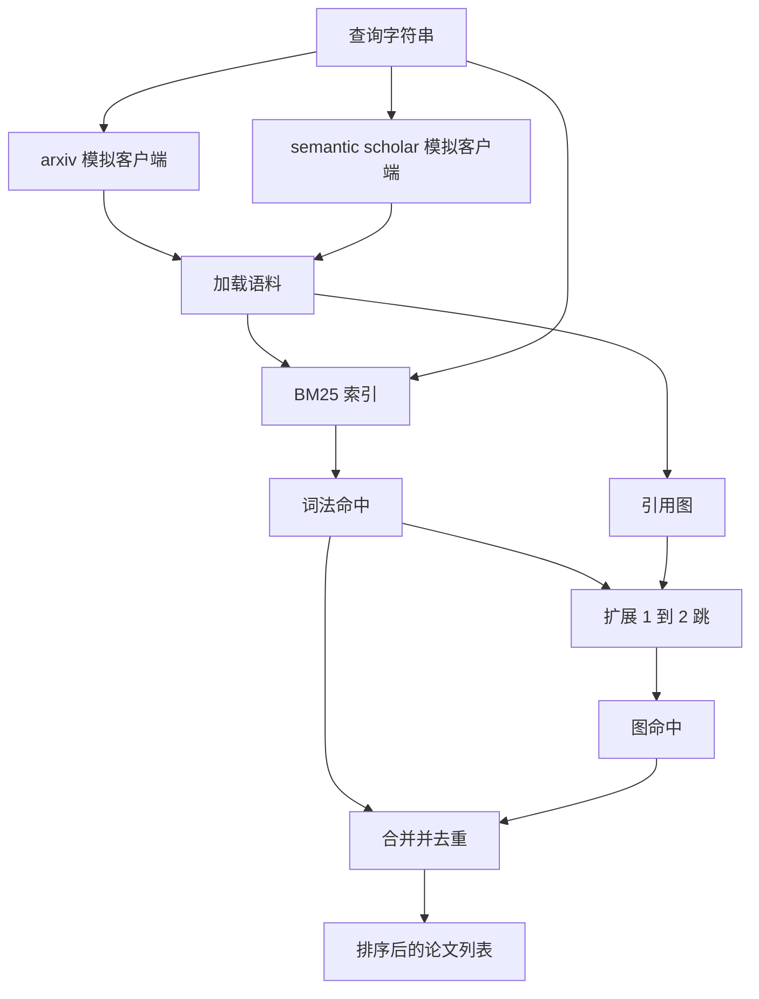

# 文献检索（Literature Retrieval）

> 假设很便宜。确认是否已经有人证明过它，才是昂贵的部分。在运行器启动沙箱之前，先构建能回答这个问题的检索层。

**类型：** 构建
**语言：** Python
**前置课程：** Phase 19 Track A 第 20-29 课
**耗时：** ~90 分钟

## 学习目标
- 建模一个小型论文记录（paper record），包含下游循环会读取的字段。
- 仅用 stdlib 数据结构在摘要上构建 BM25 索引。
- 遍历引用图（citation graph），找出词法搜索（lexical search）遗漏的论文。
- 通过稳定论文 id 对词法检索和图遍历两个阶段的结果去重。
- 用统一客户端封装两个模拟外部 API，这样当真实端点接入时，上游调用点无需变化。

## 为什么要做两轮检索

基于摘要的关键词搜索，会返回与查询共享词汇的论文。这覆盖了大部分表层结果，但会漏掉两种情况。第一种是奠基性论文使用了不同词汇；比如查询 “sparse attention” 时，可能会错过标题为 “block selection in transformer routing” 的论文。第二种是相关论文是某个已知锚点的后续工作；这时，先找到锚点再沿图向前走，比在摘要池里暴力搜索更高效。

本课会同时构建这两条路径。摘要上的 BM25 能抓住词法命中。引用图遍历则会以一个种子集合为起点，向前和向后扩展一到两跳。两者的并集会按论文 id 去重，再用一个小型组合分数进行排序。

## 论文（Paper）的结构

```text
Paper
  id          : str           (stable identifier, "p001" for the mock corpus)
  title       : str
  abstract    : str
  year        : int
  authors     : list[str]
  references  : list[str]     (paper ids this paper cites)
  citations   : list[str]     (paper ids that cite this paper)
  source      : str           (which mock api supplied it, "arxiv" or "s2")
```

`references` 和 `citations` 字段共同构成有向引用图。两个模拟 API 返回的字段有重叠，但并不完全一致，因此语料加载器会基于 `id` 做并集。

## 架构



检索客户端（retrieval client）同时拥有两轮检索和合并逻辑。调用方只需要给它一个查询，就会拿回一个排序好的列表；其中每个条目都携带按论文记录的分数字段（`bm25_score`、`graph_distance`、`recency_score`、`final_score`），以便解释排序原因。

## 从零实现 BM25

实现使用标准的 Okapi BM25，默认参数为 `k1=1.5`、`b=0.75`。索引由两个字典组成：`term -> doc_frequency` 和 `term -> list of (doc_id, term_count)`。文档长度就是摘要的 token 数。平均文档长度在构建索引时一次性计算。查询打分是对所有查询词项求和：`idf * tf_norm`，其中 `tf_norm` 是标准的 BM25 长度归一化词频。

分词器会先 `lower`，再按非字母数字拆分。它不做词干化。生产系统中可以替换为一个小型词干器。接口保持不变。

```text
idf(t)      = log((N - df + 0.5) / (df + 0.5) + 1.0)
tf_norm(t)  = (f * (k1 + 1)) / (f + k1 * (1 - b + b * dl / avgdl))
score(d, q) = sum over t in q of idf(t) * tf_norm(t)
```

## 引用图遍历

图会基于整份语料一次性构建。前向边从一篇论文指向它的 references。后向边从一篇论文指向它的 citations。遍历方式是广度优先搜索（breadth first search），起点是 BM25 得分最高的若干论文，最多扩展两跳。

两跳是刻意设定的上限。一跳太浅；智能体往往需要的是直接祖先或直接后继。三跳则会在连通图上让结果规模爆炸，而且容易跑题。本课把跳数上限暴露为一个配置旋钮，这样下游循环可以根据需要收紧。

## 去重与排序

两轮检索会返回重叠集合。合并时以论文 id 为键。对每篇论文，最终分数是一个加权混合值。

```text
final_score = w_bm25 * bm25_score_norm
            + w_graph * graph_score
            + w_recency * recency_score
```

`bm25_score_norm` 是该论文 BM25 分数除以合并集合中的最大 BM25 分数（因此该字段落在零到一之间）。`graph_score` 对直接词法命中取一分，一跳为 `0.6`，两跳为 `0.3`，其他情况为零。`recency_score` 则是从语料最小年份到最大年份的线性爬升。

默认权重是 `0.5`、`0.3`、`0.2`。这些权重是配置项；如果主题已经陈旧，就可以降低 recency 权重；如果主题变化极快，就可以提高它。

## 模拟语料

语料由 `build_corpus()` 生成，共一百篇论文。每篇论文都有手写的标题和摘要，分布在五个主题上：注意力稀疏性、检索增强、低秩适配器、数据集蒸馏，以及评测框架。references 和 citations 被连接成图，使得每个主题形成一个连通子图，并带有少量跨主题边。

两个模拟 API 客户端（`ArxivMockClient` 和 `SemanticScholarMockClient`）读取的是同一份语料，但暴露的字段不同。Arxiv 返回标题、摘要、年份和作者。Semantic Scholar 则额外提供 references 和 citations。检索客户端会按 id 求并集；至于不同客户端字段不一致时如何处理，则留给后续课程。

## 第 52 和 53 课会读取什么

第五十二课中的运行器会读取 `paper.id`、`paper.title` 以及摘要的前三句，把它们作为实验上下文。第五十三课中的评估器会读取 `paper.year` 和 `paper.references`，以便把某个基线归因到具体论文上。

检索客户端会返回一个 `RetrievalResult`，其中既包含排序列表，也包含查询级指标：命中数、平均分、最高分、总墙钟时间。运行器会记录这些指标，以便后续可观测性流程画出质量随时间变化的图。

## 如何阅读代码

`code/main.py` 定义了 `Paper`、`ArxivMockClient`、`SemanticScholarMockClient`、`BM25Index`、`CitationGraph`、`RetrievalClient` 以及一个确定性演示。模拟客户端和语料都放在同一个文件里，以保持课程可移植。BM25 实现是一个约六十行的类。图遍历只有一个方法。

`code/tests/test_retrieval.py` 覆盖了词法路径、图路径、合并、去重以及空查询。

## 它在整体中的位置

第五十课生成一个假设。第五十一课检索文献，判断这个假设是否已经被研究结论坐实。若没有，第五十二课就会运行实验。第五十三课读取检索结果与实验指标，写出最终判定。检索客户端是这四个阶段里成本最低的，因此在编排器中会最先运行。
