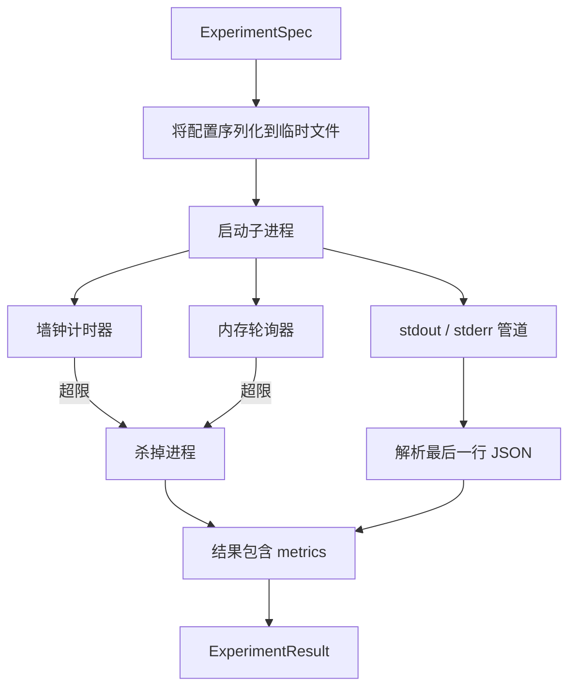

# 实验运行器（Experiment Runner）

> 一个循环有多诚实，取决于它的测量是否诚实。构建这样一个运行器：它接收实验规格，在沙箱化子进程（sandboxed subprocess）中执行，并输出一份评估器可以信任的 json 指标 blob。

**类型：** 构建
**语言：** Python
**前置课程：** Phase 19 Track A 第 20-29 课
**耗时：** ~90 分钟

## 学习目标
- 将实验编码为一个带类型的规格（spec），使运行器能够把它序列化后交给子进程。
- 以严格的墙钟超时和软内存上限启动子进程，并把这两种情况都明确暴露为终止条件。
- 把 stdout、stderr 和结构化指标 blob 一起捕获到单一结果记录中。
- 构建一张消融表（ablation table），每次只扫描一个配置旋钮，基于固定基础规格做实验。
- 让每次运行在给定 seed 时都保持确定性，这样评估器跨运行看到的数字是稳定的。

## 为什么要用子进程

研究循环会运行不可信代码。假设来自采样器，实验脚本也可能来自同一路径；如果把其中任意一个当成进程内的安全代码，就是在等着一次崩溃把编排器一起带下去。子进程是这门语言自带的最简单隔离方式：独立进程、独立地址空间，以及父进程侧可控制的 signal 句柄。

这里的运行器并没有实现完整沙箱。没有 cgroup，没有 seccomp filter，也没有 namespace remapping。它真正提供的是墙钟超时、内存增长轮询，以及在任意一个限制触发时杀掉进程的路径。这就是所有更复杂沙箱都会扩展的运行时契约。本课把这个契约压缩到足以一口气读完。

## 实验规格（ExperimentSpec）的结构

```text
ExperimentSpec
  spec_id        : str            (stable id, "exp_001")
  hypothesis_id  : int            (link back to the queue from lesson 50)
  script_path    : str            (path to the python script to run)
  config         : dict           (passed to the script as one json arg)
  seed           : int            (deterministic seed for the experiment)
  wall_timeout_s : float          (hard timeout, killed on exceed)
  memory_cap_mb  : int            (soft cap, polled; killed on exceed)
  metric_keys    : list[str]      (which fields the evaluator will read)
```

脚本位于磁盘上；运行器会把配置写入一个临时文件路径，然后由脚本去读取。脚本约定在 stdout 上打印一行 JSON，其键集合必须覆盖 `metric_keys`。stdout 上的其他内容也会被捕获，但指标解析器会忽略它们。

## 架构



运行器是一个类，只有一个主方法。轮询器是一个小线程：它会按轮询间隔醒来一次，在平台支持时从 proc 文件系统读取子进程的 `psutil` 等价信息；如果平台不提供这些信息，就回退为空操作。

## 为什么使用软内存上限

硬内存上限需要 `resource.setrlimit`，而且只在 POSIX 上生效。本课提供的是一种可移植方案：从平台读取常驻集大小（resident set size, RSS），一旦超过上限就杀掉子进程。之所以说是“软”上限，是因为轮询器有非零时间间隔；进程可能在两次轮询之间短暂冲过上限，然后又降下来。运行器会记录观测到的最大 RSS，这样评估器就能知道本次运行离上限有多近。

在不支持进程检查的系统上，轮询器会记录一次性警告并停用自己。墙钟超时仍然适用。课程测试覆盖了这两条路径。

## 捕获 stdout 与 stderr

运行器会在进程结束后把两条管道都完整读出。stdout 会逐行扫描；最后一行既能解析为 JSON、又包含所有必需 `metric_keys` 的内容，会被认定为指标 blob。更早出现的 JSON 行会保存在结果的 `intermediate_metrics` 中；评估器可以利用这些内容绘制学习曲线。

stderr 会被原样捕获到结果里。运行器不会因为非零退出码而抛异常；相反，它会把退出码记录到结果中。任何非零退出都会被标记为 `"crash"`，即使脚本打印了指标也是如此，因此默认情况下评估器会把部分完成的运行视为失败。

## 消融表

```python
def ablate(base: ExperimentSpec, knob: str, values: list[Any]) -> list[ExperimentSpec]:
    ...
```

给定一个基础规格和一个旋钮名，这个辅助函数会为每个值返回一个规格，并覆写 `config[knob]`。每个规格都会得到一个派生 `spec_id`（`f"{base.spec_id}_{knob}_{value}"`）。运行器附带了一个 `AblationRunner`，它会按顺序运行这些规格，并返回一个按旋钮值索引的 `AblationTable`。

为什么一次只扫一个旋钮？因为全因子扫描会指数级爆炸，而且会产出评估器无法解释的结果。一次只扫一个旋钮，则会形成一条干净的坐标轴，方便评估器绘图。本课只把多旋钮扫描支持为“重复执行多次单旋钮消融”，由调用方自行组合。

## 确定性

每个规格都带有一个 seed。运行器会通过配置字典把这个 seed 转发给脚本（`config["__seed"] = spec.seed`）。`code/experiments/` 中的模拟实验脚本会尊重这个 seed，从而在多次运行中产生完全一致的指标。第五十三课中的评估器依赖这一点；如果没有确定性，那么所谓“回归”可能只是不同的随机初始化。

## 模拟实验脚本

本课附带一个实验脚本：`code/experiments/sparsity_experiment.py`。它是一个真实脚本：读取配置文件，模拟一次小型训练过程，然后打印一份 JSON 指标 blob。脚本支持 `sleep_s` 旋钮，用于测试超时；也支持 `allocate_mb` 旋钮，用于测试内存轮询器。

这个模拟并没有训练任何真实模型。它只是一个数值计算，模仿训练循环的形状：损失曲线、最终困惑度、墙钟时间。本课的重点是运行器，而不是模拟本身。真正的实验脚本会去 import 模型。

## 结果（Result）的结构

```text
ExperimentResult
  spec_id              : str
  hypothesis_id        : int
  exit_code            : int
  terminal             : "ok" | "timeout" | "oom" | "crash"
  wall_time_s          : float
  peak_rss_mb          : float | None
  metrics              : dict
  intermediate_metrics : list[dict]
  stdout_tail          : str
  stderr_tail          : str
```

评估器首先读取 `metrics` 和 `terminal`。如果 `terminal` 不是 `"ok"`，那么这次实验就被记为失败运行，评估器会自动给出判定。否则，指标就会进入显著性检验。

## 如何阅读代码

`code/main.py` 定义了 `ExperimentSpec`、`ExperimentResult`、`ExperimentRunner`、`AblationRunner` 和一个确定性演示。子进程管理都在一个类里。内存轮询器是一个小线程。消融辅助函数是一个独立函数。

`code/experiments/sparsity_experiment.py` 是测试里使用的模拟实验。它从 argv 读取配置文件路径，并在完成时写出一行 JSON 指标。

`code/tests/test_runner.py` 覆盖了成功路径、超时路径、崩溃路径、消融表，以及两次运行之间的确定性检查。

## 它在整体中的位置

第五十课生成假设。第五十一课过滤掉那些文献已经给出结论的内容。第五十二课对剩余部分运行实验。第五十三课读取结果，执行显著性检验，并把编排器需要存回到假设 id 上的判定写出来。
