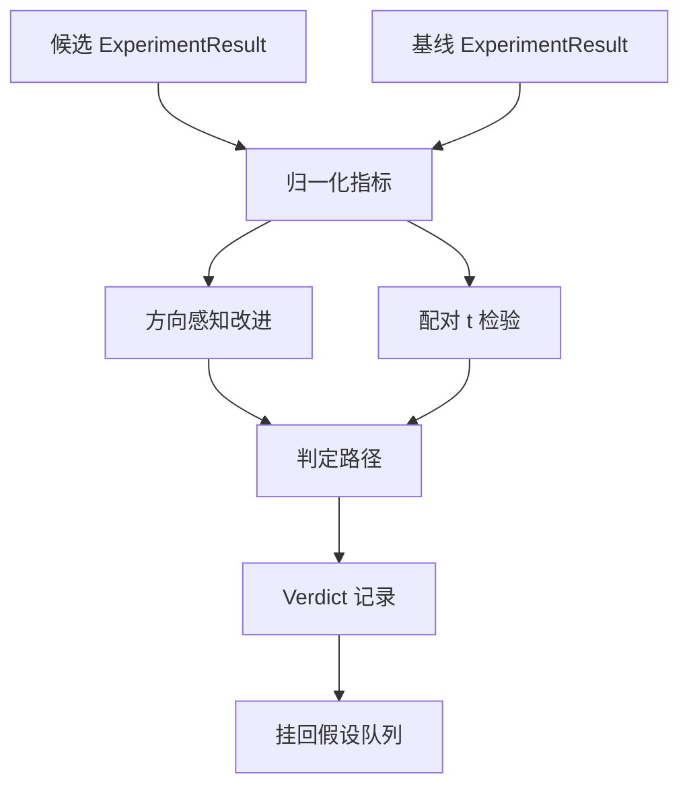

# 结果评估器（Result Evaluator）

> 运行器产出了数字。评估器要决定这些数字代表的是改进、回归，还是噪声。构建这条判定路径，把指标转换成一句结论。

**类型：** 构建
**语言：** Python
**前置课程：** Phase 19 Track A 第 20-29 课
**耗时：** ~90 分钟

## 学习目标
- 结合方向感知改进（direction aware improvement）和固定阈值，把候选运行与基线运行进行比较。
- 从零实现配对 t 检验（paired t test），基于按 seed 拆分的指标读取生成的 p 值（p value）。
- 对对数尺度指标（log scaled metrics）做归一化，以便下游报告能把它们与线性指标混合在一起。
- 为每个假设输出一个判定（verdict），让编排器可以把它挂回第五十课中的队列。
- 让每一步都保持纯函数式，这样同样的输入永远得到同样的判定。

## 为什么要做配对检验

运行器给出的单个数字，并不能说明变化是否真实存在。同样的配置，换一个 seed，就会得到不同的困惑度。变化可能只是噪声。正确的比较方式应该是配对：在同样的 seed、同样的数据上，候选配置和基线配置各运行一次。每个 seed 都贡献一个差值。差值均值是效应，差值标准误则是噪声底线。

本课会从零实现这项检验。这里没有 `scipy.stats`。相关数学足够小，一屏就能读完。

```text
diffs    = [a_i - b_i for i in seeds]
mean     = sum(diffs) / n
variance = sum((d - mean) ** 2 for d in diffs) / (n - 1)
t_stat   = mean / sqrt(variance / n)
df       = n - 1
p_value  = two_sided_p(t_stat, df)
```

双侧 p 值使用正则化不完全 beta 函数（regularised incomplete beta function）来计算。本课附带了一个基于 Lentz continued fraction 的小型实现。整段代码只有六十行 stdlib 数学。

## 方向感知改进

有些指标在变大时更好（准确率、吞吐量）。另一些则在变小时更好（损失、困惑度、墙钟时间）。评估器会在每个指标上携带一个 `direction` 字段。

```text
if direction == "higher_is_better":
    improvement = (candidate - baseline) / abs(baseline)
elif direction == "lower_is_better":
    improvement = (baseline - candidate) / abs(baseline)
```

改进值是带符号的。对“越高越好”的指标来说，负改进值就表示候选配置更差。判定路径会同时读取它的符号和幅度。

一个固定阈值（`improvement_threshold=0.02`，即百分之二）用来判断变化是否足够大。低于这个阈值时，无论 p 值是多少，判定都为 `"noise"`；因为循环并不关心用户根本测不出来的变化。

## 架构



评估器会执行三项彼此独立的计算，然后在判定路径中把它们合并。每项计算都是纯函数，没有共享状态。

## 对数归一化

困惑度相对损失是指数关系。损失下降 0.1，通常对应着更大的困惑度下降。直接比较两组配置的困惑度没有问题，但如果要把它和线性指标放进同一份报告里，就必须先做归一化。

本课对任何 `scale` 字段为 `"log"` 的指标，都会先取自然对数，再计算改进值。阈值也在 log 空间中应用。比如困惑度从 32 降到 28，在“越低越好”指标上对应 `log(28) - log(32) = -0.133`，显然远高于两个百分点的阈值。

```text
if scale == "log":
    a = log(candidate)
    b = log(baseline)
else:
    a = candidate
    b = baseline
```

`scale="linear"`（默认值）的指标会跳过这个变换。同一条代码路径可以同时处理两种情况。

## 按 seed 配对的检验

第五十二课中的运行器每次运行只会输出一份最终指标 blob。而在做配对检验时，评估器需要候选配置在每个 seed 上的一份结果，也需要基线配置在每个 seed 上的一份结果。编排器会在一组 seed 上分别运行两种配置，并把两组 `ExperimentResult` 记录列表交给评估器。

评估器会通过 `result.metrics["seed"]` 中的 seed 对它们进行配对，并沿着指定指标逐个比较。如果两组列表中的 seed 对不上，评估器就会抛出 `PairingError`。这意味着编排器应当重新运行。

## 判定（Verdict）的结构

```text
Verdict
  hypothesis_id          : int
  metric                 : str
  direction              : "higher_is_better" | "lower_is_better"
  scale                  : "linear" | "log"
  candidate_mean         : float
  baseline_mean          : float
  improvement            : float       (signed, fraction; see direction rules)
  p_value                : float | None  (None if n < 2)
  significance_threshold : float
  improvement_threshold  : float
  verdict                : "improved" | "regressed" | "noise" | "failed"
  rationale              : str
```

判定路径是一张很小的决策表：

```text
1. If any candidate result has terminal != "ok": verdict = "failed"
2. else if |improvement| < improvement_threshold:  verdict = "noise"
3. else if p_value is None or p_value > significance: verdict = "noise"
4. else if improvement > 0:                          verdict = "improved"
5. else:                                             verdict = "regressed"
```

`rationale` 是一句人类可读的单行解释，编排器可以把它记录到对应的假设 id 上。

## 如何阅读代码

`code/main.py` 定义了 `MetricSpec`、`Verdict`、`Evaluator`、t 统计量与不完全 beta 的辅助函数，以及一个确定性演示。t 检验完全使用 stdlib 数学实现；`numpy` 只用于读取指标列表并计算均值与方差。

`code/tests/test_evaluator.py` 覆盖了改进路径、回归路径、噪声路径（改进太小）、噪声路径（样本数太低）、终止失败路径、对数归一化路径、与已知参考值对齐的 t 检验，以及配对错误。

## 它在整体中的位置

第五十课产出了假设队列。第五十一课过滤掉文献已经给出结论的内容。第五十二课在多个 seed 上分别运行候选配置和基线配置的实验。第五十三课读取这些运行结果并写出判定。编排器把四者串起来：

```text
for hypothesis in queue:
    literature = retrieval.search(hypothesis.text)
    if literature_settles(hypothesis, literature):
        attach(hypothesis, verdict="settled")
        continue
    candidates = runner.run_all(specs_for(hypothesis))
    baselines  = runner.run_all(baseline_specs_for(hypothesis))
    metric_spec = MetricSpec("perplexity", direction=LOWER, scale=LOG)
    verdict = evaluator.evaluate(hypothesis.id, metric_spec, candidates, baselines)
    attach(hypothesis, verdict)
```

这个编排器并不在本课里；这四节课可以靠各自定义的 dataclass 自然拼装起来，不需要额外胶水。
