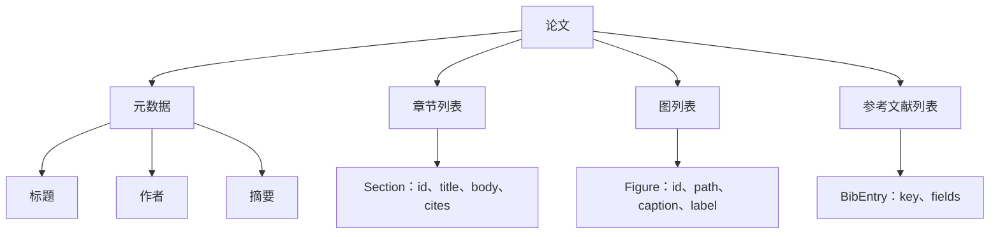
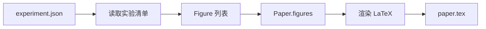
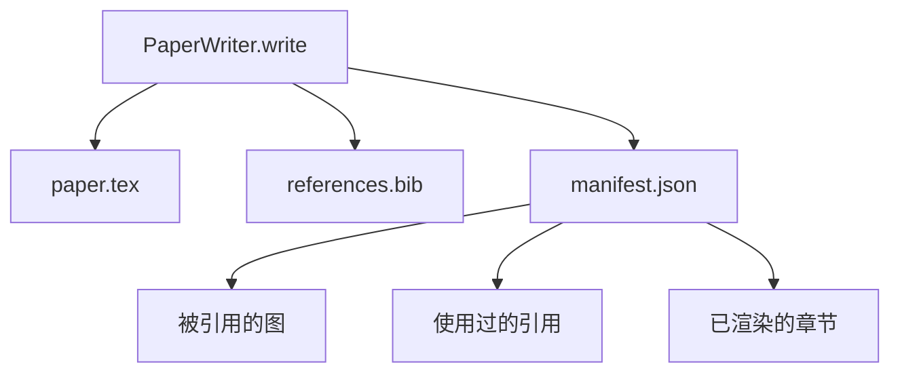

# 论文写作器（Paper Writer）

> LaTeX 骨架（LaTeX skeleton）是研究者与排版器之间的契约。如果契约被破坏，文档就无法编译，而且失败会非常刺眼。先把骨架搭好，再往里填内容。

**类型：** 构建
**语言：** Python
**前置课程：** Phase 19 第 50-53 课
**耗时：** ~90 分钟

## 学习目标

- 把研究论文视为结构化产物（structured artifact），具有明确章节图，而不是一份自由形态文档。
- 生成一个 LaTeX 骨架，在任何正文写入之前就声明摘要、章节、图槽位和参考文献键。
- 通过确定性的槽位机制，把实验输出中的图（路径与标题）注入骨架中。
- 接入一个模拟正文生成器（mocked prose generator），基于结构化提纲填充每个章节，从而让整个 harness 无需模型也可测试。
- 输出单个 `paper.tex`、`references.bib`，以及一个清单（manifest），列出所有被引用的图和所有使用过的引用。

## 为什么要先有骨架

从正文开始写的草稿，会不断积累结构债务。引言里长出三段本该放到相关工作的内容。图在被定义之前就先被引用。参考文献最后会为同一篇论文出现三个 key。等作者意识到这些问题时，重写成本往往已经高于写作成本。

骨架会把这一切倒过来。结构先作为数据声明。章节是带名称和顺序的槽位。图是带 id 和标题的槽位。参考文献键在顶部先声明，并绑定它们指向的条目。正文再按槽位逐段生成。这样一来，在任何正文写入之前，harness 就可以验证：每张图是否都有槽位、每个引用是否都有条目、每个章节是否都出现在目录里。

这与前面课程在计划、工具调用和 trace 上采用的纪律完全一致。结构就是契约。

## 论文（Paper）的结构

每个字段都只是普通 Python 数据。渲染器（renderer）是一个纯函数：从 `Paper` 到 LaTeX 字符串。harness 可以在渲染之前先检查这篇论文：统计章节数、列出缺失的图文件、检查每个 `\cite{key}` 是否都有对应的 `BibEntry`。

## 渲染契约（render contract）

渲染器保证三个性质。第一，骨架中的每个图槽位都会输出一个 `\begin{figure}` 块，并带有稳定标签，形如 `fig:&lt;id>`。第二，每个章节都会输出一个 `\section{}`，并带有形如 `sec:&lt;id>` 的稳定标签，以保证交叉引用可用。第三，参考文献部分会输出一个 `\bibliography` 块，而 `references.bib` 中包含的条目恰好等于论文上声明的那些条目，不多也不少。

违反其中任意一条都属于渲染错误，而不是警告。骨架就是契约；一个静默丢掉图的渲染，就是契约破裂。

## 从实验结果注入图

本轨道前面的课程把实验输出产生成 JSON 清单。每份清单都带有一组产物及其路径和简短标题。论文写作器会读取这份清单，并生成 `Figure` 记录。

这个注入过程是确定性的。图 id 来自实验名加上单调递增计数器。标题来自清单。路径会相对于论文输出目录做归一化，因此即使实验输出放在磁盘别处，LaTeX 也仍然可以编译。

## 模拟正文生成器

本课不会调用模型。`MockProseGenerator` 会读取一个提纲结构，并以确定性方式输出正文。这个提纲结构为每个章节提供一个短字符串。生成器会把它扩展为两段简短正文，并把章节标题编织进去。当提纲声明了图和引用时，生成出来的正文也会准确地提到它们。

这已经足够测试写作器的所有行为。真实实现只需要把生成器替换成模型调用即可。围绕它的 harness 不需要变化。这正是把正文生成器声明为一个可调用对象的价值：测试时替换为确定性生成器，生产时替换为模型生成器，而流水线其余部分完全不变。

## 清单输出（manifest output）

写作器会向输出目录写入三个文件。

清单才是下游评估器或批评循环会读取的东西。它不会去解析 LaTeX；它只读取清单。下一课，也就是批评循环，会把这份清单作为输入并产出反馈列表。这就是为什么清单是契约的一部分，而 LaTeX 本身不是。

## 验证闸门

在写入任何文件之前，写作器会先跑四道闸门。

1. 论文中的每个 figure id 都必须唯一。
2. 每个章节的 `cites` 字段都必须引用论文中声明过的参考文献 key。
3. 摘要不能为空。
4. 标题不能为空。

任意一道闸门失败，都会抛出 `PaperValidationError`，并给出精确原因。harness 会把这个原因直接作为失败模式向外暴露。不会发生部分写入：要么三个文件都成功生成，要么一个都不写。

## 如何阅读代码

`code/main.py` 定义了 `Paper`、`Section`、`Figure`、`BibEntry`、`PaperValidationError`、`MockProseGenerator`、`PaperWriter` 以及 `render_latex` 函数。`write` 方法接收一个输出目录，并写出 `paper.tex`、`references.bib` 和 `manifest.json`。`read_experiment_manifest` 辅助函数会把一组实验清单转换为 `Figure` 记录。

`code/tests/test_paper_writer.py` 覆盖：无章节时的骨架渲染、带两个章节和两张图的完整渲染、缺失引用闸门、重复图 id 闸门、清单内容，以及 LaTeX 字符串契约（每个章节都要输出一个 `\section{}`，每张图都要输出一个 `\begin{figure}`）。

## 继续扩展

真实实现会想要两个扩展。第一，多格式渲染：同一个 `Paper` 结构可以编译成博客用的 Markdown，也可以编译成预览用的 HTML。渲染器会变成 `Paper` 上的一种策略。第二，引用增强：给定本地 DOI 缓存后，写作器可以根据引用 key 拉取 BibTeX 条目。两者都很有价值，而且都不需要触碰骨架契约。

骨架就是赌注。章节、图和引用都作为数据声明，正文被生成到槽位里，清单与 LaTeX 一同产出。其余所有改进都能在这之上自然叠加。
