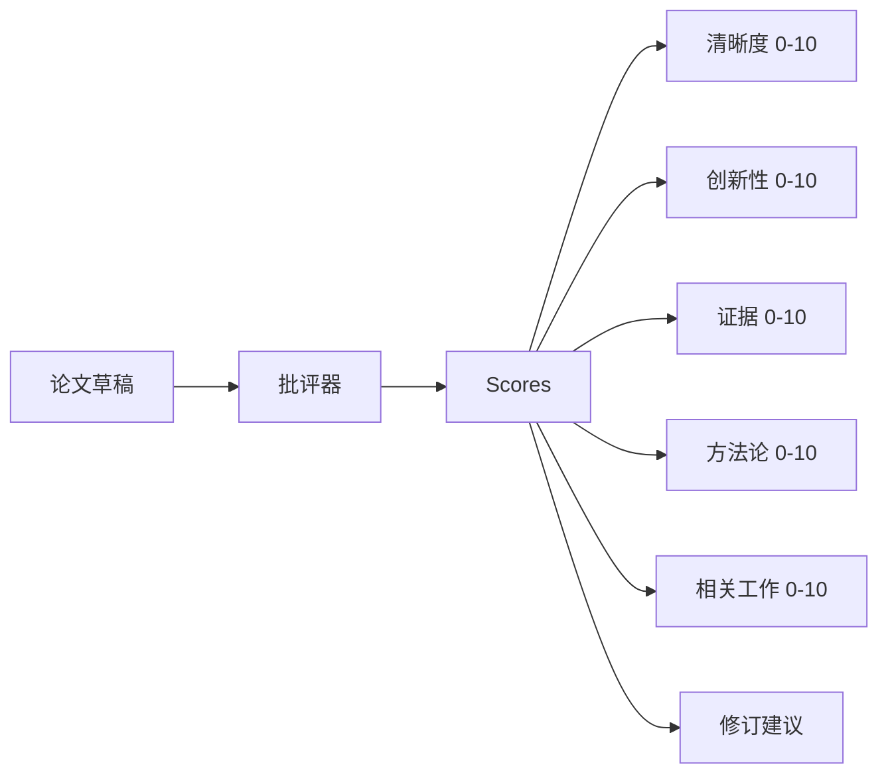
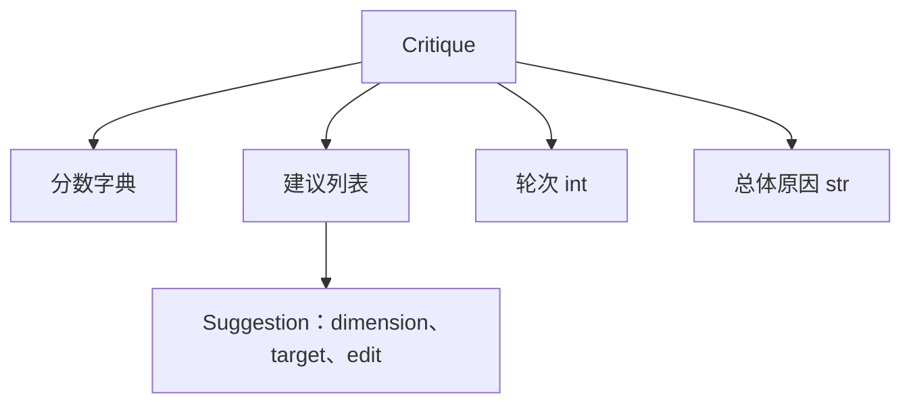
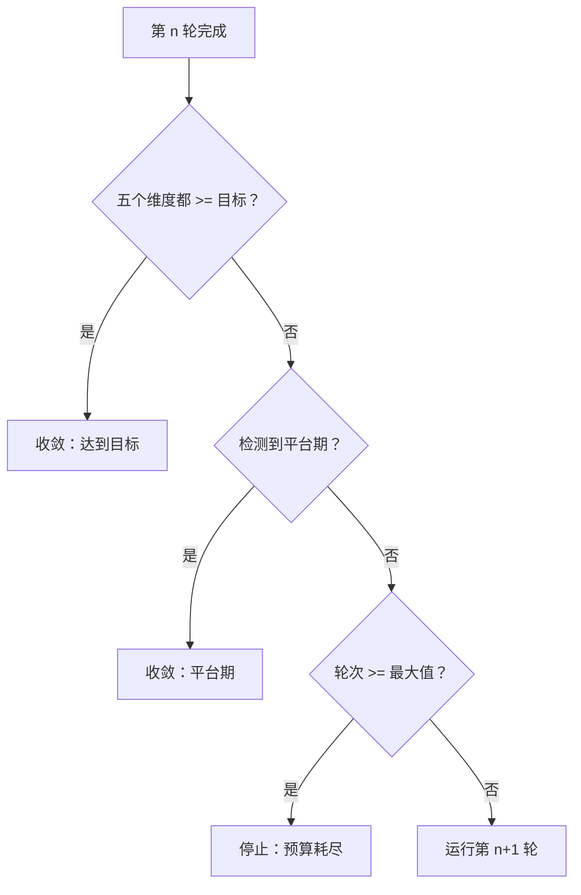
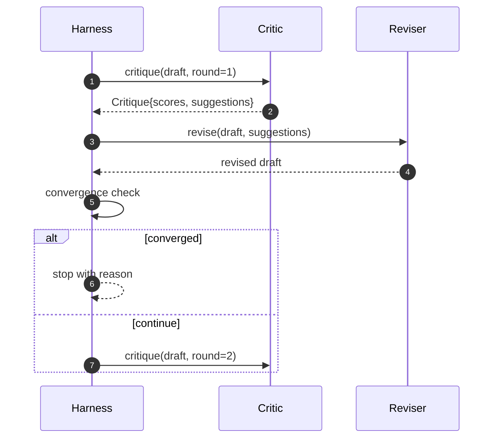

# 批评循环（Critic Loop）

> 第一次就返回“看起来不错”的批评器是坏掉的。总是返回“还需要改”的批评器也是坏掉的。有意思的批评器，是那个会收敛的批评器，而收敛需要你主动设计出来。

**类型：** 构建
**语言：** Python
**前置课程：** Phase 19 第 50-53 课
**耗时：** ~90 分钟

## 学习目标

- 沿五个固定维度为论文草稿打分：清晰度、创新性、证据、方法论、相关工作。
- 将每一轮批评应用为结构化修订 diff，而不是自由改写。
- 通过比较各轮分数检测收敛；在进入平台期、达到目标或预算耗尽时停止。
- 用最大迭代预算限制轮数，避免不收敛的批评器永远运行下去。
- 输出逐轮 trace，让仪表盘或下一阶段能够绘制分数轨迹。

## 为什么要用五个固定维度

一个自由形态的批评器，本质上只是一个返回建议段落的模型。下一轮修订会把这个段落当作环境上下文。改写到底有没有解决批评意见，是无法验证的，因为批评本身没有结构。

五个维度为 harness 提供了一个契约。



分数是一个向量。harness 会跨轮次监视每个维度。一次修订如果提升了清晰度，却把证据维度打垮了，那么在证据维度上它就是一次回归，收敛检查能看见这一点。纯模型式批评器无法给出这样的保证。

## 批评（Critique）的结构



每条建议都会携带它所改善的维度、目标章节，以及修订器（reviser）可以应用的 `edit` 指令。修订器本身也是一个可调用对象。本课附带了一个确定性修订器：它把 `edit` 解释为“向章节追加内容”的操作。模型驱动的修订器也会解释同一个字段，只不过它会把它当作提示词。契约不变。

## 收敛规则，按顺序执行

只要以下三个条件中的任意一个触发，批评循环就会终止。



“达到目标”是最严格的情况：五个维度（clarity、novelty、evidence、methodology、related_work）必须全部达到 `>= target_score`（默认 `8.0`），循环才算成功结束。平均分很高但有一个维度很弱，是不够的。平台期检测会比较当前轮均值与上一轮均值。如果这个提升在连续两轮里都低于 `plateau_epsilon`（默认 `0.1`），循环就会以 `plateau` 退出。预算则是轮数硬上限（默认 `5`），以 `budget` 退出。

执行顺序很重要。目标优先于平台期，平台期优先于预算。如果第三轮恰好达到目标，同时也满足平台期条件，结果应当是 `target`，而不是 `plateau`。

## 为什么平台期检测要跨两轮

只看一轮的平台期，基本就是噪声。真实批评器即使面对同一份草稿，也会在每轮返回略有不同的分数，因为即便评分逻辑是确定性的，也仍然取决于上一轮应用了哪些建议、应用顺序是什么。要求连续两轮进入平台期，才能把这类噪声滤掉。如果 harness 报告了平台期，那就说明草稿确实已经不再改善。

## 本课中的确定性批评器

本课不会调用模型。课程附带的批评器是一个可调用对象，它基于三个信号为草稿打分：章节平均正文长度（清晰度）、图数量与引用数量（证据），以及论文元数据中的 `originality_tag` 字段（创新性）。修订器知道如何把每个分数往上推。

```text
clarity      grows when the average section body length increases
novelty      grows when originality_tag is set to "high"
evidence     grows when a section's figure_refs is non-empty
methodology  grows when a section titled "Method" exists with body
related-work grows when a section titled "Related Work" exists with body
```

修订器会把每条建议解释为一次定向追加。第一轮之后，harness 就能观察到分数开始上升。测试正是利用这一性质来断言循环在缩小差距。

## 完整循环契约



harness 负责轮次计数器、trace 和收敛检查。批评器负责打分。修订器负责 diff。三者都不碰彼此的状态。

## Trace 输出

每一轮都会产出一条 trace 事件，包含轮次编号、分数向量、建议数量以及收敛判定。完整 trace 会和最终草稿一起返回。下游仪表盘可以据此绘制每轮分数曲线。下一课，也就是迭代调度器，会读取这个 trace 来决定这个分支是否值得保留。

## 防止坏批评器失控的预算

如果一个批评器给出的建议永远无法提升分数，那么循环就会被锁死在最大迭代上限里。trace 会把这件事暴露得非常清楚：五轮、分数平坦、判定为 `budget`。用户会把它理解为批评器 bug，而不是草稿 bug。相反，如果只暴露最终草稿，就会把诊断信息藏起来。trace-first 设计能把它显性化。

## 如何阅读代码

`code/main.py` 定义了 `Critique`、`Suggestion`、`Critic` protocol、`Reviser` protocol、`CriticLoop`，以及一个 `make_deterministic_critic_pair` 工厂函数，用来返回确定性批评器及其匹配的修订器。课程还附带了一个最小 `Paper` 结构，让这一课可以独立存在。

`code/tests/test_critic_loop.py` 覆盖：第一轮之后的单调改进、在调优草稿上达到目标收敛、连续两轮持平后的平台期检测、没有任何建议能提升分数时的预算耗尽、修订器对建议的应用，以及 trace 的结构。

## 继续扩展

真实实现会想要两个扩展。第一，维度权重：面向 workshop 的论文会更看重新颖性，而期刊更看重方法论，反之亦然。这样一来，收敛检查就会变成加权平均。第二，成对批评器：一个批评器负责打分，另一个批评器在修订器看到建议之前先做裁决。两者都很有价值，而且都建立在同一个 `Critique` 结构之上。

真正的赌注是这个分数向量。一旦批评被结构化，其他所有改进、收敛规则、仪表盘和成对批评器，都可以直接插进来，而不需要改变循环本身。
