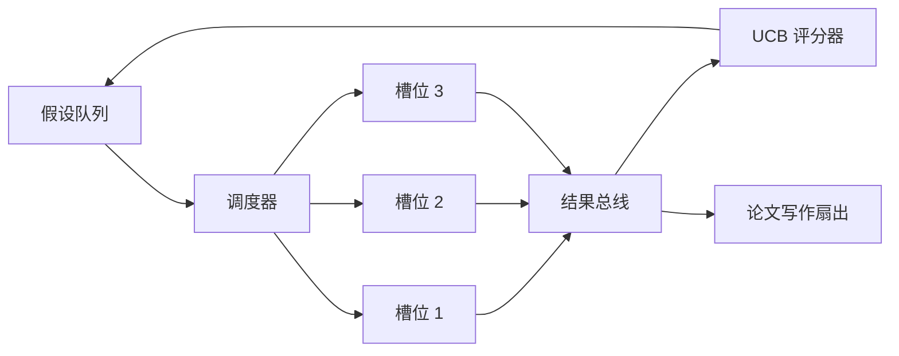
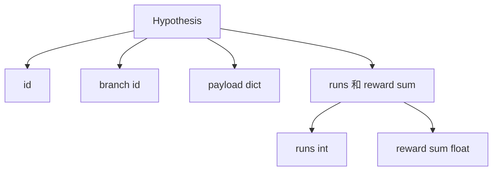
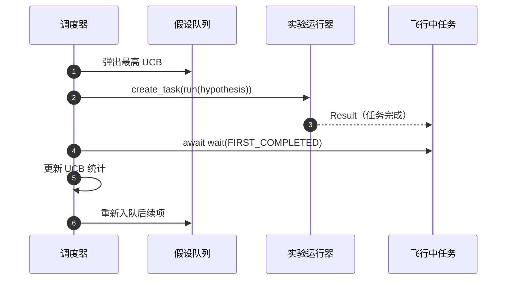

# 迭代调度器（Iteration Scheduler）

> 没有调度器的研究循环，只是一条自我感觉良好的队列。调度器决定了循环停止探索什么，而这个决定本身就是全部游戏。

**类型：** 构建
**语言：** Python
**前置课程：** Phase 19 第 50-53 课
**耗时：** ~90 分钟

## 学习目标

- 把研究工作流建模为一个假设队列，它向并行实验槽位供给任务，再把结果汇聚回来。
- 用 asyncio 并发运行多个实验，让调度器始终把所有槽位填满。
- 用 UCB 为每条假设分支打分，让调度器在不放弃探索的前提下剪掉低收益分支。
- 把已完成的结果扇出到论文写作阶段与重新入队阶段，让高收益分支生成后续假设。
- 暴露逐迭代 trace，其中包含分支分数、槽位占用情况和剪枝决策。

## 为什么需要调度器，而不是工作列表

平面工作列表会按提交顺序执行作业。当每个作业彼此独立时，这没问题。但研究任务并不独立：实验三的发现，会改变实验四和实验五的优先级。一个会读取结果汇入、并重新排序队列的调度器，能用同样的算力做出更有价值的工作。

真正关键的设计选择，是评分规则。贪心评分器只会一直选当前领先者，永远不探索。均匀评分器则永远不利用已有优势。UCB（upper confidence bound）介于两者之间：既利用当前领先分支，又为尝试次数较少的分支预留容量。

## 系统形状



队列持有假设。每当某个槽位空出来，调度器就会挑选 UCB 最高的假设。每个槽位都以异步方式运行一个实验。完成的实验会把结果扇入总线。总线会更新来源分支的 UCB 统计，并在某条分支收益超过阈值时，把事件扇出到论文写作阶段。

## 假设（Hypothesis）的结构



`branch` 是 UCB 统计的键。多个假设可以共享同一条分支（分支代表研究方向，假设代表该方向中的一次试验）。`runs` 是这个分支已完成实验的计数，`reward_sum` 是累计奖励。UCB 会读取这两个值。

## UCB 评分

本课使用的 UCB 公式是经典 UCB1。

```text
ucb(branch) = mean_reward(branch) + c * sqrt( ln(total_runs) / runs(branch) )
```

`total_runs` 是所有分支上已完成实验的总数。`c` 是探索权重；本课默认值为 `sqrt(2)`。零次运行的分支会被赋值为 `+inf`，因此未尝试过的分支总会先被调度。高平均收益分支会一直保持高分，直到其他分支追上；而某个分支如果跑了很多次却几乎没有回报，就会被那些尝试次数更少的替代项压过去。

剪枝闸门和挑选器是分开的。剪枝会在某条分支的平均收益低于绝对下限（默认 `0.2`），并且已运行至少 `prune_after_runs` 次（默认 `3`）后，将它从未来调度中移除。这样可以让队列保持有界。

## 用 asyncio 跑并行槽位

调度器会通过 `asyncio.create_task` 驱动实验。每个任务都会运行实验运行器（一个 `async def` 可调用对象），并返回一个 `Result`。主循环会对飞行中的任务集合执行 `asyncio.wait(..., return_when=asyncio.FIRST_COMPLETED)`，并在每次任务完成时更新评分。



三个槽位会并发运行。主循环从不为某一个实验单独阻塞。只要有槽位空出来，调度器就会立刻启动新任务，直到队列为空且没有飞行中任务为止。

## 扇出：触发论文写作

当某个分支的平均收益超过 `paper_threshold`（默认 `0.7`），并且该分支还没有产出过论文时，调度器就会向一个输出列表扇出 `paper.trigger` 事件。下游的第五十四课论文写作器本会消费这个事件。本课里，它只会被捕获为一个列表，方便测试断言。

## 扇出：后续假设

当一个高收益结果到达时，调度器可以调用用户提供的 `expander`，为同一条分支产出一个或多个后续假设。这个扩展器是从 `Result` 到 `list[Hypothesis]` 的纯函数。本课附带了一个确定性扩展器：只要结果奖励高于论文阈值，它就会产出两个后续假设。

## 预算

两个预算可以保护调度器不至于跑飞。

```text
max_experiments    : total count of experiments run across all branches
max_seconds        : wall-clock cap (asyncio time)
```

任意一个预算触发后，调度器都会停止调度新任务，等待飞行中的任务完成，然后返回最终 trace。这个 trace 会带有 `stop_reason`。

## Trace 与最终报告

每个调度决策（挑选、派发、结果、剪枝、扇出）都会产生一个事件。最终报告会汇总每条分支的统计、总运行次数、总墙钟时间，以及已触发的论文事件。下一课，也就是端到端演示，会读取这份报告来驱动论文写作器。

## 如何阅读代码

`code/main.py` 定义了 `Hypothesis`、`Result`、`BranchStats`、`IterationScheduler`，以及一个 `make_deterministic_runner` 工厂函数，它会返回一个带可预测奖励的 asyncio 实验运行器。这个运行器会睡眠固定的 `delay_ms`（默认 `5ms`），因此并发行为是可观察的。

`code/tests/test_scheduler.py` 覆盖：UCB 会优先挑选未尝试分支、并行槽位占用、跨过阈值时触发论文事件、低收益试验后的分支剪枝、扇出后续假设，以及预算退出（实验总数与墙钟时间两种情况）。

## 继续扩展

真实实现会想要三个扩展。第一，跨会话持久化 UCB 统计：当前统计只存在内存里；真正的调度器会把它们 checkpoint 下来，从而在重启后保留已经花掉的探索预算。第二，多目标评分：每个结果不是单一标量奖励，而是一个向量，此时 UCB 会变成类似 Pareto 的挑选器。第三，上下文 bandit：挑选器根据假设特征（长度、复杂度）来条件化，因此相似假设可以共享探索。

调度器是研究从工作列表升级为真正循环的地方。一旦 UCB 接好、槽位并行跑起来，其余所有改进都可以自然叠加在上面。
