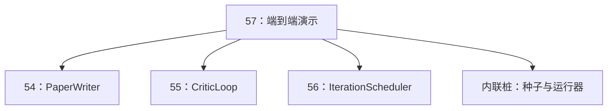
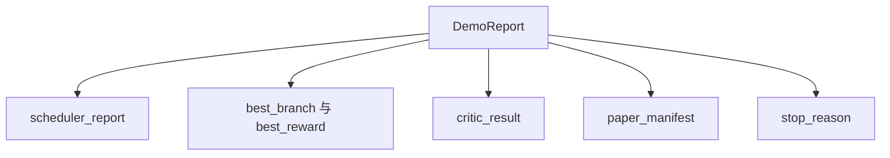

# 端到端研究演示（End-to-End Research Demo）

> 演示（demo）是你之前写下的每一条契约都必须真正组合起来的地方。只要有一条漏了，这节演示课就会把它抓出来。

**类型：** 构建
**语言：** Python
**前置课程：** Phase 19 第 50-53 课
**耗时：** ~90 分钟

## 学习目标

- 把自动研究循环（auto-research loop）从头到尾串起来：假设种子、实验运行器、调度器、批评循环、论文写作器。
- 通过普通 Python import 来组合前面四节 Track D 课程中的原语，而不是引入一个框架。
- 把整个循环运行到能够自行终止，并输出一份单一演示报告，列出每个阶段的输出。
- 让演示保持确定性，这样测试套件就能断言最终结果形状。
- 当任何阶段的契约被破坏时，暴露清晰失败模式，避免下一阶段拿着坏输入继续运行。

## 这里组合了什么


一共五个阶段。种子是三个假设组成的列表。调度器会在三个并行槽位上运行六次实验。总线会报告一个或多个论文触发事件。选择器会挑出单个最佳结果。批评循环会围绕这个结果构建草稿并迭代。论文写作器则输出最终的 LaTeX、BibTeX 和 manifest。

## 为什么是 import，而不是复制

每节前置课程都带有一个 `main.py`，其中暴露了公共 dataclass 和函数。这个演示会通过调整 `sys.path`，把每节课的父目录加入导入路径，然后直接 import 它们。这不是某种框架接线；它和前面课程测试文件里已经在用的导入方式完全一样。



内联桩（inline stub）用来代替第五十到第五十三课：一个小型种子假设生成器，以及一个同步奖励函数。用户只需调整两个 import，就可以把内联桩替换成这些课程中的真实原语。

## 确定性保证

这个演示从构造上就是确定性的。实验运行器使用带 seed 的 numpy。批评循环中的修订器会按固定维度、固定顺序工作。论文写作器使用的是第五十四课中的模拟正文生成器。调度器的 UCB 挑选器在分数相同时会按迭代顺序打破平局，而不是随机选择。

在同样的 seed 下，演示会输出同样的报告。测试会运行两次演示并比较 manifest，以断言这一性质。

## 演示报告（demo report）的结构



每个字段都直接来自上游阶段。演示不会转换任何输出；它只是把它们组合起来。而这正是演示本身要验证的东西。

## 失败模式处理

每个阶段要么成功，要么抛出带类型的错误。

```text
Scheduler ........ returns SchedulerReport with stop_reason
                   in {queue_empty, max_experiments, deadline}
Best-result pick . raises NoTriggerError if no paper trigger fired
Critic loop ...... returns LoopResult with status converged or stopped
Paper writer ..... raises PaperValidationError on contract break
```

任何阶段的失败都会以带类型的异常短路整个演示。测试会固定这一契约：`test_no_triggers_raises_typed_error` 和 `test_best_picker_raises_when_no_triggers` 会断言，当没有分支触发事件时，选择器会抛出 `NoTriggerError` / `BestResultError`，并且写作器绝不会被调用。

## 最佳结果选择器

调度器会按分支发出论文触发事件。选择器会在所有触发事件里，选出平均收益最高的那条分支。若出现并列，则按分支 id 的字母顺序打破平局，以保证演示确定性。这个选择器是一个很小的纯函数；测试会用固定调度报告把它钉住。

## 如何接线批评循环

第五十五课中的批评循环操作对象是 `MiniPaper`。演示会根据被选中的分支构建一个 `MiniPaper`：把摘要填入分支 id、预置两个章节（Introduction 和 Results），并根据分支平均收益设置 `originality_tag`（`>= 0.8` 为 high，`>= 0.6` 为 medium，否则为 low）。

随后，修订器会让这份草稿迭代到收敛。输出再交给论文写作器。

## 如何接线论文写作器

第五十四课中的论文写作器操作对象是完整的 `Paper` 结构，包含图和参考文献。演示会通过 `mini_to_full_paper` 把收敛后的 `MiniPaper` 升级成完整论文：为被选中的分支附加一张图，并基于批评器建议过的 cite key 并集构造一小份合成参考文献。演示新增的每个 cite，都会同步加入参考文献列表，因此验证会通过。

## 如何阅读代码

`code/main.py` 定义了 `BestResultError`、`NoTriggerError`、`DemoReport`、`pick_best_branch`、`build_mini_paper`、`mini_to_full_paper` 和 `run_demo`。文件顶部的 import 会一次性调整 `sys.path`，并从对应课程里拉取 `PaperWriter`、`CriticLoop` 和 `IterationScheduler`。

`code/tests/test_e2e.py` 覆盖：演示能够端到端跑通并产出五个字段都已填充的报告、两次运行之间的确定性、没有分支跨过阈值时抛出 `NoTriggerError`、写作器契约被破坏时抛出 `PaperValidationError`、论文 manifest 包含被选分支的图，以及调度器停止原因属于预期集合。

## 继续扩展

当演示变绿之后，有三个扩展值得接上。第一，持久化状态：把每个阶段的结果写入一个小型 JSON 存储，这样重启时就能在不重跑廉价阶段的情况下继续。第二，仪表盘：把调度器和批评循环的 trace 事件渲染成一条统一时间线。第三，真实模型调用：把模拟正文生成器和确定性批评器替换为模型驱动版本；接线方式完全不变。

这个演示的职责，就是证明“组合本身就是架构”。五节课、四个 import、一份报告。下次你再加一个阶段时，接线只会多长一行。
